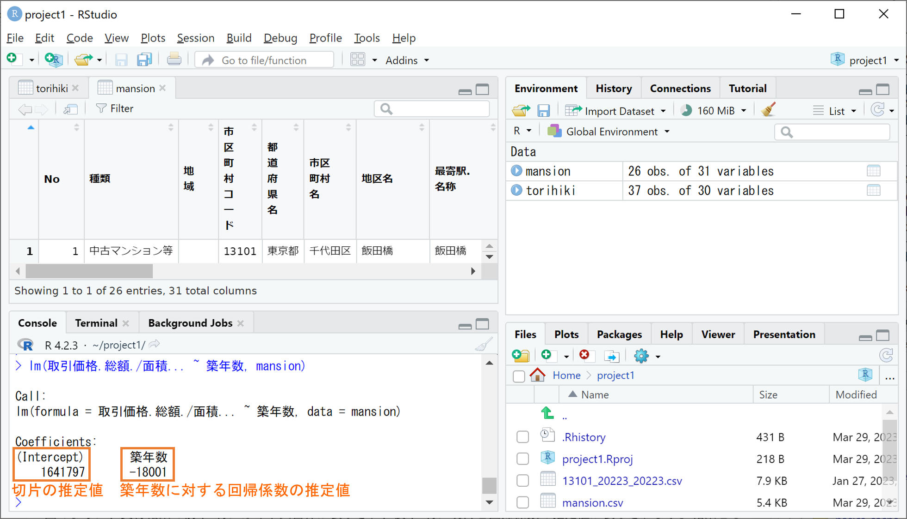
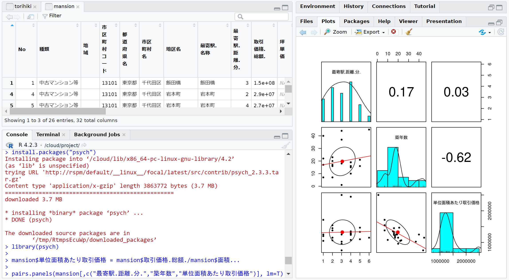

```{r setup, include=FALSE}
knitr::opts_chunk$set(message=FALSE,warning=FALSE, cache=TRUE)
```

最後にこちらでは、RStudioにおける回帰分析と作図を簡単に紹介いたします。

## 回帰分析

回帰分析とは、データの変数間の関係式（回帰式と言います）を推定する分析です。回帰分析では、ある予測したい変数（目的変数）を、目的変数と相関をもつ他の変数（説明変数1, 説明変数2,...）を用いて

目的変数 ＝ 切片 ＋ 回帰係数1 × 説明変数1 ＋ 回帰係数2 × 説明変数2 ＋・・・＋ 誤差

の形で表現し、誤差がなるべく小さくなるように切片と回帰係数を推定します。Rではlm関数を使ってこの回帰分析を次のように1行で実行することができます。

lm(目的変数名 ~ 説明変数名1 + 説明変数名2 + ..., データフレーム名)

例として、ファイル入出力の例で作成したデータフレームmansionについて、目的変数を 単位面積あたり取引価格(取引価格.総額./面積...)、説明変数を築年数として回帰してみましょう。この回帰分析は、次の命令文により実行することができます。

lm(取引価格.総額./面積... ~ 築年数, mansion)

上記のように、目的変数は複数の変数（取引価格.総額.と面積...）を組合せて用意することもできます。上記の命令文の実行結果を下図に示します。

{width=80%}

上図のように、実行結果の前半2行には命令文自体が表示され、後半3行に切片と回帰係数の推定値が表示されます。結果として、単位面積あたり取引価格(取引価格.総額./面積...)を予測する回帰式は

単位面積あたり取引価格 ＝ 切片 ＋ 回帰係数 × 築年数 ＋ 誤差 ＝ 1641797 － 18001 × 築年数 ＋ 誤差

と推定されたことになります。この回帰式から、千代田区の中古マンション等の単位面積あたり取引価格は、築年数0年なら約164.2万円で、築年数が1年多いごとに約1.8万円ずつ下がる傾向にあると予測されることになります。

この他にも、最寄駅までの所用時間（最寄駅.距離.分.）など、単位面積あたり取引価格に影響しそうな変数はありますので、皆さんの方で回帰式に加えるとどうなるか試してみてください。

## 作図

データ分析では、上のような定量的分析がもちろん大事ですが、その結論をグラフなどで視覚的に訴えることもまた重要です。
RおよびRStudioでは以下に紹介するような関数を用いて簡単に作図することができます。作成した図は画像ファイルで保存して、レポートやプレゼン資料に貼り付けることができます。

### plotsタブと図の保存

RStudioでは、作図の関数を使って描かれる図は、ほとんどの場合、下図の右下にあるplotsタブに表示されます。下図は、データフレームmansionについて横軸を築年数、縦軸を単位面積あたり取引価格(取引価格.総額./面積...)とした散布図をplot関数でまず描き、そこに上で推定された回帰式の直線（回帰直線）をabline関数で追加したものです。

{width=80%}

新たに作図する度にplotsタブに表示される図は置き換わりますが、plotsタブ左上の左右の矢印をクリックすることで、これまでに作図した図を行ったり来たりすることができます。保存したい図を表示したところで、plotsタブのZoomボタンまたはExportボタンをクリックして以下の操作をすることで、画像ファイルとして保存することができます。

- Zoomボタンをクリックすると、下図のように図が別ウィンドウで表示されます。ウィンドウサイズを調整することで図の大きさを調節し、図を右クリックしてSave image as...をクリックしてください。すると下図のようにファイル保存するウィンドウが現れますので、ファイル名を適当に変更（特に末尾（拡張子）を.pngとすることでpngファイルであることを明示した方がよいです）して保存してください。

{width=60%}

- Exportボタンをクリックすると、下図のようなウィンドウが現れますので、Image format(画像ファイルの種類)、File name(ファイル名)、WidthとHeight(画像の幅と高さのピクセル数)を選択した後、右下のSaveをクリックして保存してください。

{width=80%}

### plot関数

まずは最も基本かつ最もよく使われるplot関数の主な使い方を以下に記します。
plot関数に利用できる引数は把握しきれないほど多く存在します。良く使われる主な引数だけ載せたplot関数の使い方を下記に示します。ただし、下記の最初の引数以外は、引数を省略しても適当なデフォルト値（たとえばxlimは横軸の数値ベクトルの最小値・最大値）が設定されます。

| plot(横軸の数値ベクトル, 縦軸の数値ベクトル, main = 図のタイトル, xlab = 横軸名, ylab = 縦軸名,
|    xlim = c(横軸の作図範囲の下限,上限), ylim = c(縦軸の作図範囲の下限,上限),
|    type = \"p\", col = 1, pch = 1, cex = 1, lty = 1, lwd = 1)
|    

以下に、上記の最後の行にある各引数の設定を説明します。

- type：グラフの種類（デフォルトは"p"の散布図）

  - type = \"p\"：散布図

  - type = \"l\"：折れ線グラフ

  - type = \"o\"：点付き折れ線グラフ（"p"と"l"を両方描く）

- col：点・線の色（デフォルトは1の黒）

  - col = 1,2,3,4,5,6,7,8：黒,赤,緑,青,水色,紫,黄,灰色（暗い色彩）

  - col = \"red\",\"green\",\"blue\",\"orange\",...：赤,緑,青,橙など（明るい色彩）

  - col = 0：無色透明（図に点を描きたくないときに用いる）

- pch：点の種類（デフォルトは1の〇）

  - pch = 1,2,3,4,5,6,...：〇,△,＋,×,◇,▽,...

- cex：点の大きさ（デフォルトは1）

- lty：線の種類（デフォルトは1の実線）

  - lty = 1：実線

  - lty = 2：破線（切れ目のある線）

  - lty = 3：点線

  - lty = 4：鎖線（破線と点線の混合）

  - lty = 5：破線（lty = 2 より切れ目間隔が長い）

- lwd：線の太さ（デフォルトは1）

以下に、点の色(col)・種類(pch)・大きさ(cex)を点ごとに変えた点付き折れ線グラフ(type = "o")を例として示します。

```{r}
x = 1:8   # 横軸の値（色と点種）
y = 1:8/2 # 縦軸の値（点の大きさ）
plot(x, y, type="o", col = 1:8, pch = 1:8, cex = 1:8/2, main = "点の表示例", xlab = "色と点種", ylab = "点の大きさ")
```

### 点・線の追加

plot関数で描いた図には、以下の関数を用いて後からさらに点や線を加えることができます。
点の追加はpoints関数、折れ線の追加はlines関数が以下のように使えます。plot関数との違いは、既存の図に点や線を加えるだけのため、図のタイトル、各軸名、各軸の作図範囲の下限上限を指定できないところです。

points(横軸の数値ベクトル, 縦軸の数値ベクトル, type = \"p\", col = 1, pch = 1, cex = 1, lty = 1, lwd = 1)

lines(横軸の数値ベクトル, 縦軸の数値ベクトル, type = \"l\", col = 1, pch = 1, cex = 1, lty = 1, lwd = 1)

また、abline関数を用いると、無限遠まで伸びる直線を引くことができます。abline関数の使い方は数パターンあり、以下に主に使われる4パターンを列挙します。

水平線の追加：abline(h = 線の縦軸位置,  col = 1, lty = 1, lwd = 1)

垂直線の追加：abline(v = 線の横軸位置,  col = 1, lty = 1, lwd = 1)

斜め線の追加：abline(a = 切片, b = 傾き, col = 1, lty = 1, lwd = 1)

回帰直線の追加：abline(lm(縦軸の変数名 ~ 横軸の変数名, データフレーム), col = 1, lty = 1, lwd = 1)

上の4パターンのうち最初の3つを使った例を以下に示します。最後の回帰直線の追加は、上の「plotsタブと図の保存」にて例を示していますのでそちらをご参照ください。

```{r}
plot(0,0,col=0,xlim=c(1,5),ylim=c(1,5),main="abline関数の使用例",xlab="線の種類",ylab="線の太さ") # 点無し（col=0で無色透明）で指定した範囲の枠を作成
abline(h = 1:5, lwd = 1:5) # 太さの異なる水平線を5本追加
abline(v = 1:5, lty = 1:5) # 線の種類の異なる垂直線を5本追加
abline(a = 0, b = 1) # 対角線を追加
```

### par関数による図の調整

上では、図の中に日本語を表示していますが、Macで同じように実行すると日本語が正しく表示できない（□で表示される）問題が発生します。その場合、plot関数を使う前に下記の命令文を実行して、あらかじめ図中の文字フォント(family)を指定することで、図に日本語を表示できるようになります。

par(family = \"HiraKakuProN-W3\")

このpar関数は、図中の文字フォント以外にも様々な図の調整を行うことができます。たとえば図中の文字サイズを指定するには、次のように引数psに適当な数値を指定します。

par(ps = 20)

また、私はplot関数で作図をする前によく次の命令文を実行して図の余白等をあらかじめ調整しています。

par(mar = c(3,3,1,1), mgp = c(1.5,0.5,0))

上記で、引数marはplot関数で描かれる枠の下、左、上、右に確保する余白の大きさを数値ベクトルで順に指定しています。
また、引数mgpは各軸から軸名、目盛り数値、目盛り線をどれだけ離すかを数値ベクトルで順に指定しています。
上記の設定により、plotsタブの余白を小さくして図をより大きく見せることができます。

### pairs.panels関数

最後に、回帰分析を行う前にデータの変数間の関係を観察するのに便利なpairs.panels関数を紹介しておきます。pairs.panels関数はpsychパッケージの関数であるため、まずpsychパッケージを「関数とパッケージ」にて述べた方法によりインストールしてください。

インストールしたpsychパッケージをlibrary(psych)で読み込み、データフレームmansionに単位面積あたり取引価格（取引価格.総額./面積...）を列追加した上で、単位面積あたり取引価格, 最寄駅.距離.分., 築年数の3つの変数の相関関係を下記のpairs.panels関数で作図して確認します。

pairs.panels(データフレーム(一部列を抽出), lm = T)

すると、下図のようにplotsタブに3×3のパネルが並び、対角線上には各変数のヒストグラム（
＆密度推定）、対角線下には各変数ペアの散布図（＆縦軸を目的変数、横軸を説明変数とする回帰直線）、対角線上には各変数ペアの相関係数が、一挙に表示されます。なお、最後の引数 lm = T は散布図に回帰直線を加えるために追加したものです。

{width=100%}

まず上の図から変数間の相関関係を以下のように観察します。

- 最寄駅.距離.分.と築年数はほぼ無相関に近い（相関係数0.17）。

- 最寄駅.距離.分.は単位面積あたり取引価格もほぼ無相関（相関係数0.03）である。

- 築年数は単位面積あたり取引価格とやや強い負の相関（相関係数-0.62）がある。

その結果、単位面積あたり取引価格を目的変数とした回帰式を立てるのに、築年数は有力な説明変数候補となりますが、最寄駅.距離.分.は説明変数候補となり難いことが分かります。

このような**探索的データ分析**は、回帰式の候補を先入観で決めずにデータから客観的に考察するための重要なプロセスとなります。皆さんも、興味のあるデータを持ち寄って探索的データ分析から回帰分析までのデータ分析をぜひ試してみてください。

