```{r setup, include=FALSE}
knitr::opts_chunk$set(message=FALSE,warning=FALSE, cache=TRUE)
```

## まずは計算

PCあるいはRStudio Cloud上でのRStudioの起動に成功しましたら、とりあえず使ってみましょう。
RStudioはデータ分析以前に関数電卓のような使い方が可能であり、筆者もよく関数電卓代わりに使っています。

RStudioを起動した画面の右側に下図のようなタブ（Consoleタブ）があると思います。そのタブの白い部分のどこかをクリックすると下部にある青字">"の右でカーソル"|"が点滅します。その状態で、キーボードで1+2+3と入力してからEnterキー(MacならReturnキー)を押してみてください。すると、下図のように計算結果が"[1] 6"という形で次の行に表示され、その次の行に再び青字">"が表示されてそこに次の入力が可能となります。このように、Consoleタブは計算式などの命令文を入力して実行する機能を持ちます。


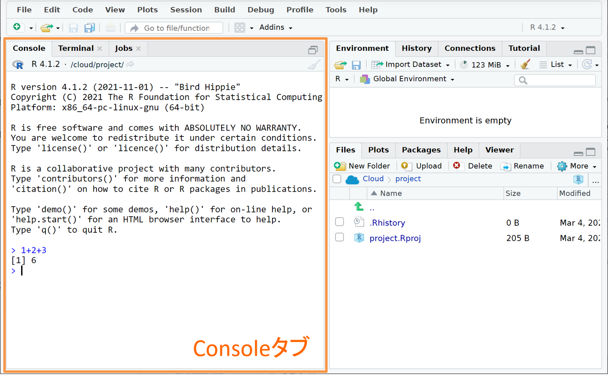{width=60%}

Rでは四則演算を含む演算子が多数実装されており、括弧()で括ることで演算順序も指定できます。以下に主な演算子とその計算結果を示します。

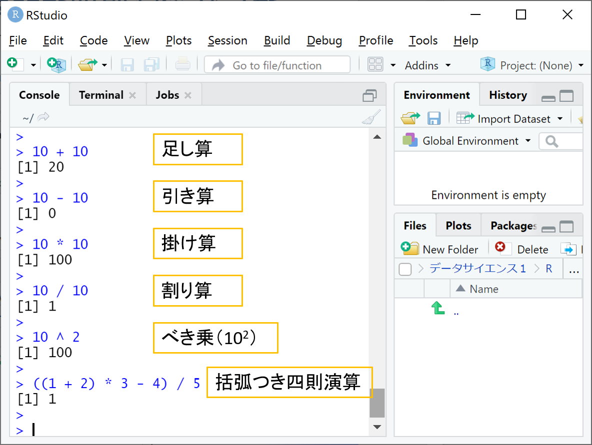{width=60%}

大き過ぎる数値、小さ過ぎる数値は下図のように浮動小数点表示で表されます。また、円周率はpiという文字で参照することができます。なお、電卓ではエラーになるような1/0、0/0の計算も、Rでは下図のように無限(Inf)、非数値(NaN; Not a Number)という特殊表記で結果を返してくれます。他の特殊表記として欠損値(NA; Not available)というのもあり、こちらの意味は後で解説します。

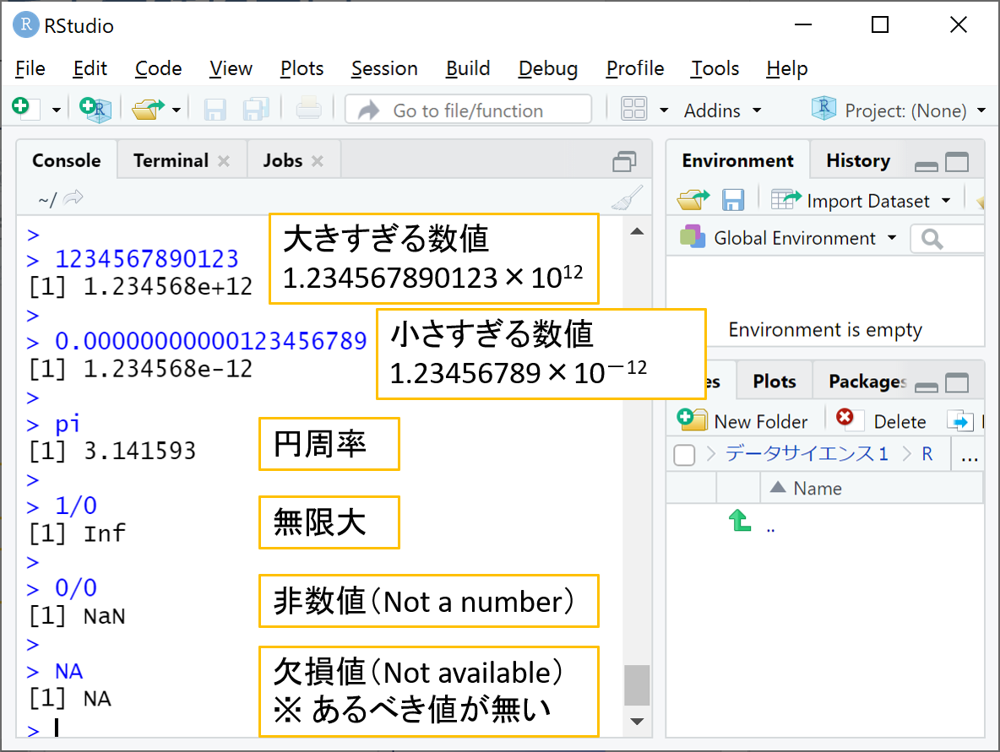{width=60%}

Enterで実行した命令文に構造的な誤りがある場合には、次の行にエラー内容が赤字で表示されて命令文が実行されずに終了します。初歩的な例としては、下図のように数値の中に全角数字、空白(スペース)、桁区切り(,)などが紛れるとエラーとなります。

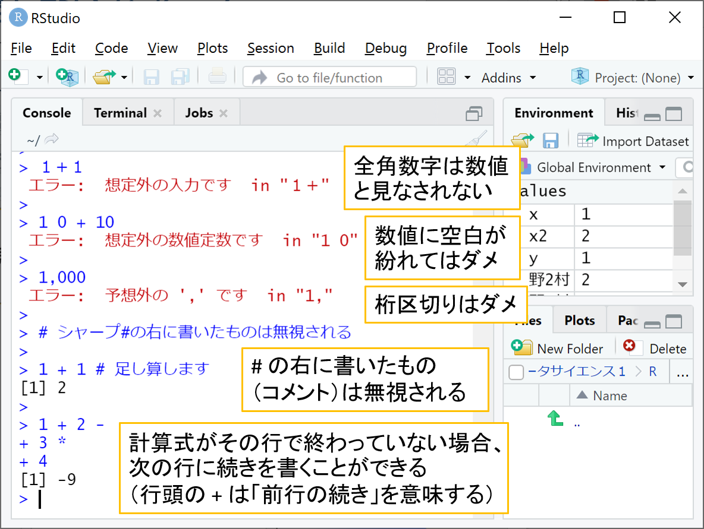{width=60%}

上図の命令文で、#(シャープ)の右側に書かれた内容は全て実行時に無視されます（これをコメントと言います）。
また、命令文が完結していない状態（たとえば 1+2-）でEnterを押した場合、次の行に青字"+"が表示され、その右に命令文の続きを入力することができます（命令文が完結するか文法エラーになるまで何度Enterを押しても次の行に青字"+"が表示され続けます）。

## タブ構成

RStudioにはConsoleタブ以外にも様々なタブが存在します。タブは下図のように画面の左側、右上、右下に分散して配置されており、後で説明するよく利用されるタブだけ以下に概要を記します。

- 左側（後述するスクリプトやデータビューが左上に表示されているときは左下となります）
    - Consoleタブ：命令文を入力して実行し、その実行結果を表示します。

- 右上
    - Environmentタブ：後述する「オブジェクト」（データや変数）が一覧表示されます。
    - Historyタブ：Consoleタブで実行された命令文の履歴が参照できます。

- 右下
    - Filesタブ：ファイルやフォルダを操作できます。
    - Plotsタブ：作図された図が表示されます。
    - Packagesタブ：後述する「パッケージ」をインストールしたり読み込むことができます。
    - Helpタブ：関数等のヘルプを表示します。

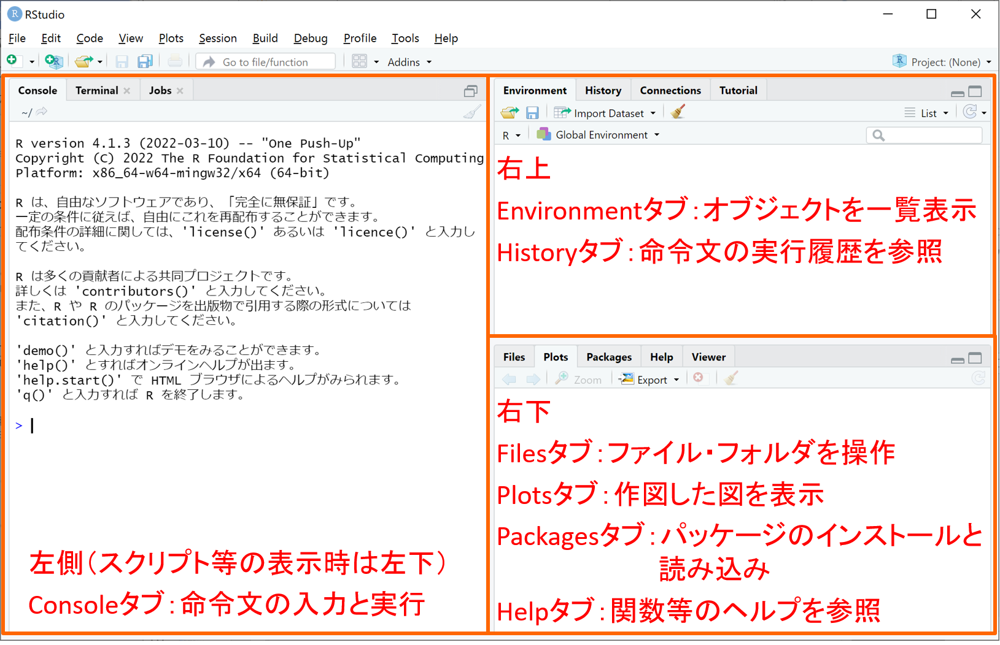{width=80%}

## 命令文の実行履歴

Consoleタブで実行した命令文の履歴は、以下の３通りの方法で参照することができます。

- Consoleタブ↑（上矢印）キーを押す度に1つ前に実行した命令文がConsoleタブに呼び出されます。

- 右上のHistoryタブをクリックすると、これまでに実行した命令文の履歴が一覧表示されます。

- Historyタブに表示される命令文の履歴は「.Rhistory」というファイルを参照しており、このファイルをテキストエディタなどで開くことでも命令文の履歴を参照できます。

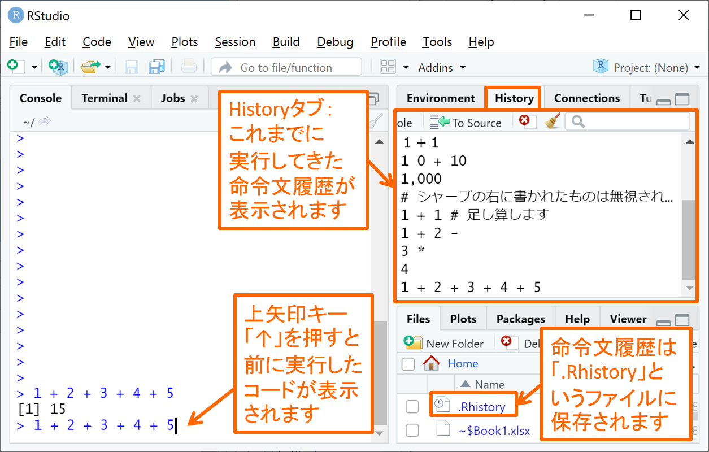{width=80%}

## スクリプト

命令文をまとめたソースコードを保存しておきたい場合には、スクリプトを作成するのが便利です。下図のように、画面上部の左端にある丸囲み＋付き白四角のアイコンをクリックし、R Scriptをクリックすると、新規のRスクリプトが画面左上に表示されます。このときConsoleタブは左下へと縮小されます。

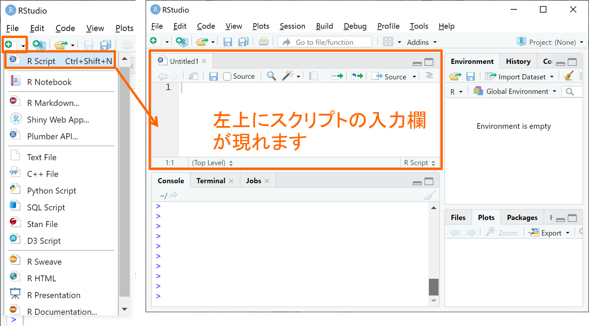{width=80%}

スクリプトにソースコードを書きましたら、下図のように実行したい範囲を選択してRunボタンを押せば、選択範囲がConsoleタブへと貼り付けられて実行されます。

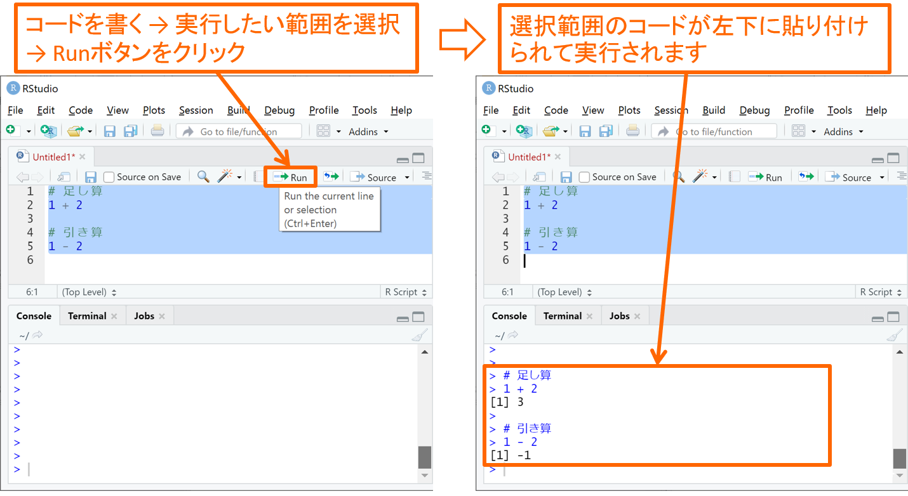{width=80%}

スクリプトは下図のアイコンをクリックして保存することができます。スクリプトには一般に".r"の拡張子を付けて保存するのが慣習となっています。保存されたスクリプトは、右下のFilesタブでファイル名をクリックすることで再び開くことができます。

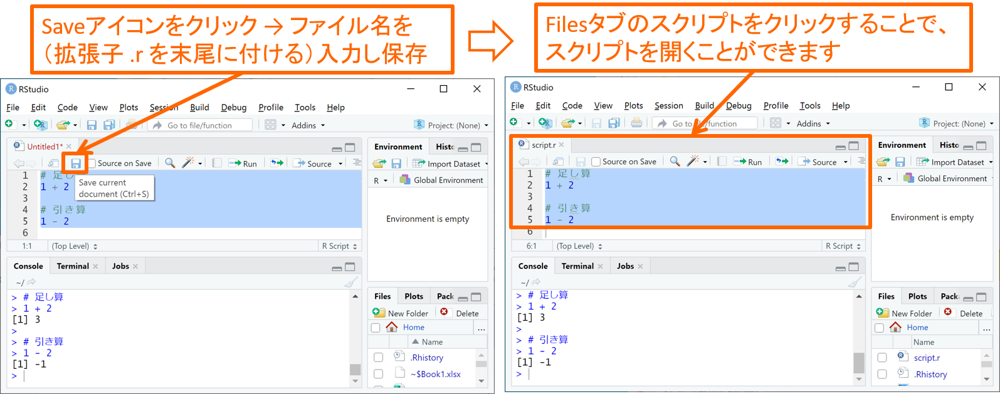{width=80%}


## プロジェクト

RStudioには、スクリプトだけでなく命令文の実行履歴やオブジェクト（後述）を丸々まとめて「プロジェクト」と呼ばれる拡張子.Rprojのファイル形式で保存することができます。RStudio CloudとPC(Windows/Mac問わず)とで勝手がだいぶ異なるので、それぞれでの使い方を解説します。

### RStudio Cloudの場合

RStudio Cloudでは、RStudioを起動させるのにプロジェクトが必須となります。その代わりに、RStudioでの作業状況は随時プロジェクトに上書き保存され、プロジェクトを閉じてから再び開いたときに閉じた時点の状況が丸々再現されて作業継続できるメリットがあります。以下にRStudio Cloudでのプロジェクトの主な操作方法について説明します。

- <u>プロジェクトの作成</u>： 「ログイン後のRStudio起動」にて既に解説しましたように、ログイン直後の画面にて右上にある"New Project"をクリックし、出てきたプルダウンから"New RStudio Project"をクリックすることでプロジェクトを新規作成することができます。下図はプロジェクトを新規作成した直後の様子であり、プロジェクト名は上部に表示された"Untitled Project"となっていますので、名前をクリックして改名してください。

{width=80%}

- <u>プロジェクトを開く</u>： 作成済みのプロジェクトがある場合には、ログイン直後の画面右側にて下図のように作成済みプロジェクトが表示されますので、開きたいプロジェクト名をクリックすることでプロジェクトを開いてください。

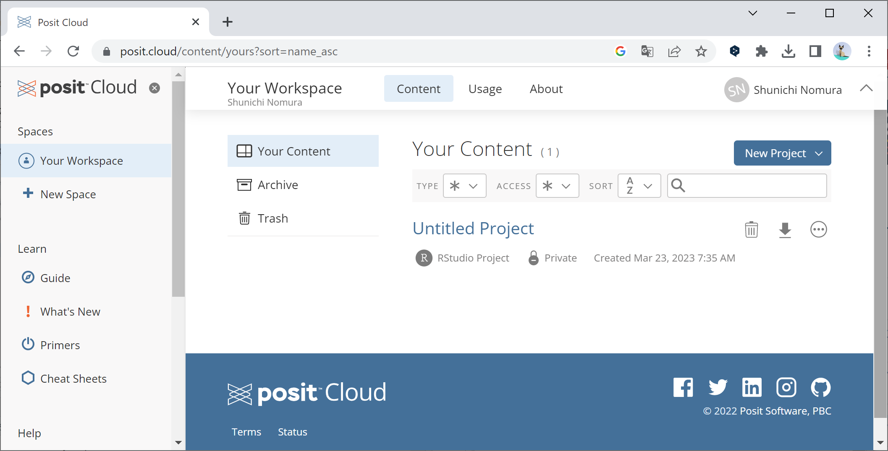{width=80%}

- <u>プロジェクトの削除</u>：RStudio Cloudの無料アカウントでは、保管できるプロジェクト数に上限（５０個）があるため、上限に達しそうな場合にはプロジェクトを整理する必要があります。ログイン直後の画面右側に出てくる作成済みプロジェクトについて、プロジェクト名の右側にあるゴミ箱のアイコンをクリックするとプロジェクトを削除することができます。また、同じくプロジェクト名の右側にある下向き矢印のアイコンをクリックすると、プロジェクトをフォルダごと圧縮したzipファイルでダウンロードすることができますので、削除する前にダウンロードしておくと良いでしょう。なお、削除したプロジェクトは削除後30日間に限り、上図の"Your Workspace"の下にある右に"Trash"と書かれたゴミ箱のアイコンに保管されており復元することが可能です。

### PC(Windows/Mac)の場合

PC上のアプリケーションとして利用するRStudioでは、プロジェクトは主にPC上の新規フォルダとして作成され、そこにスクリプトや実行履歴（.Rhistory）、ワークスペース（後述）、入力データ、出力グラフ等を保存していくことになります。RStudio Cloudとは異なり、RStudioを閉じた時点の状況が丸々再現はできません（Consoleタブの表示内容やPlotsタブの図など）。既存のソースコードをコピー＆貼り付けして試してみる程度の使い方であればプロジェクト作成は不要です。

- <u>プロジェクトの作成</u>： プロジェクトの新規作成は以下のステップで行うことができます。

Step.1： RStudioを起動後、画面上部の左側にある丸囲み＋付きR入り立方体のアイコンをクリックしてください。

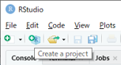{width=30%}

Step.2： 左上に"New Project Wizard"と書かれた下図のウィンドウが現れるので、上側の"New Directory"をクリックしてください（真ん中の"Existing Directory"をクリックして既存のフォルダ上にプロジェクトを作ることも可能ですが、ファイル管理のしやすさから"New Directory"で新たなフォルダを作ることをお薦めします）。 

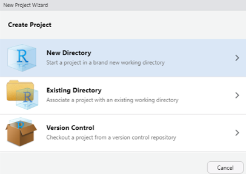{width=40%}

Step.3： 下図のウィンドウへと遷移するので、上側の"New Project"をクリックしてください。 

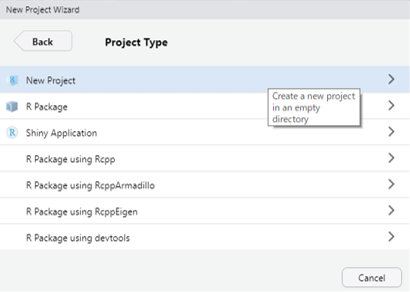{width=40%}

Step.4： 下図のウィンドウへと遷移するので、上側の"Directory name"の欄に作成するフォルダ名（プロジェクト名）を入力してから、右下の"Create Project"ボタンをクリックしてください（下図では例として"project1"というフォルダ名を入力しました）。 

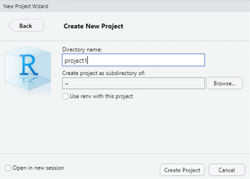{width=40%}

Step.5： ウィンドウが閉じて下図のように新規作成プロジェクトが立ち上がった状態となります。下図RStudio画面の左上にはプロジェクト名（＝Step.4で入力したフォルダ名）が表示され、右下のFilesタブは新規作成されたフォルダに移され、フォルダには「プロジェクト名.Rproj」というファイルが1つだけ置かれています。この状態でRStudioの作業を行ってください。

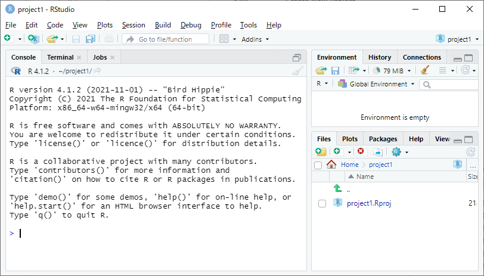{width=60%}

Step.6： RStudioを閉じる際には下図のようなウィンドウが現れますので、"Save"をクリックして終了することで、次にプロジェクトを開いたときに閉じた時点のワークスペース（後述）が復元されます。

{width=30%}

- <u>プロジェクトを開く</u>： RStudioを起動すると、基本的に最後に閉じたプロジェクトが開く仕様になっています。他のプロジェクトを開きたい場合には、下図のように画面上部の右端にある立方体にRが入ったアイコンをクリックし、"Open Project"あるいはその下にある最近使われたプロジェクト名（project1, project2）をクリックしてください。

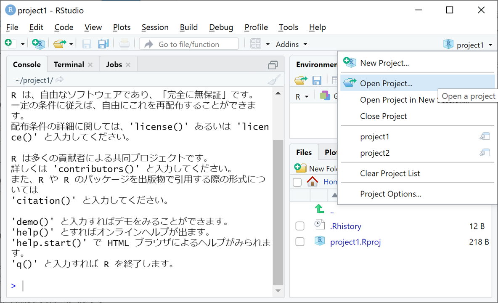{width=60%}

- <u>プロジェクトの削除</u>： プロジェクトを削除するには、プロジェクトの入ったフォルダを丸ごと削除することでプロジェクトを削除することができます。


