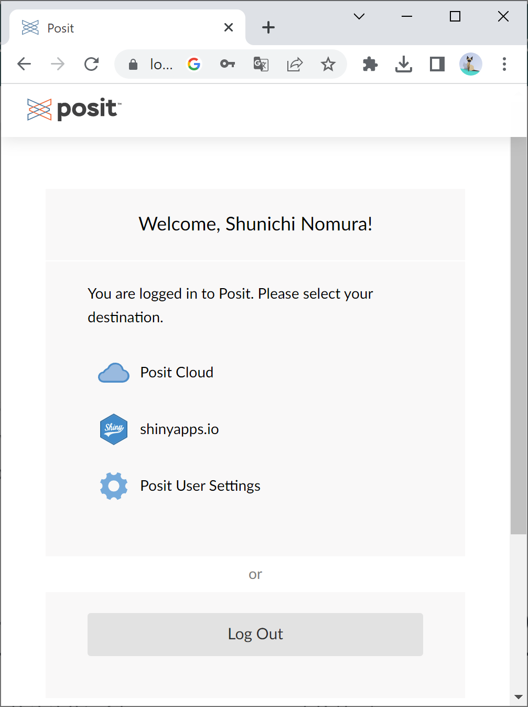

```{r setup, include=FALSE}
knitr::opts_chunk$set(message=FALSE,warning=FALSE, cache=TRUE)
```

こちらでは、自身のパソコンでRとRStudioをインストールして利用する代わりに、インストール無しでWebブラウザ上でRStudioを利用する方法（Posit Cloud）を紹介します。

## Posit Cloud (旧RStudio Cloud)とは

Webブラウザ上でRStudioを扱うことのできるクラウドサービスです。Webブラウザ上でアクセスするサーバー上でRStudioを動かすため、OS(Windows/mac)などのコンピュータ環境の違いによるトラブルや動作の違いは起こらず、使用するコンピュータを変えても同一の結果を得ることができます。

Posit Cloudには無料アカウント（Free plan）と有料アカウント（数種類のplan）があり、無料アカウントの場合には利用にあたり以下の制限があることに注意してください。

- 月の利用時間上限が25時間

- 保存できるプロジェクト数上限が25個

- 1つの命令文の実行時間の上限が1時間

- 利用できるメモリ量は1GB

もし、月の利用時間上限に引っかかってしまった場合は、別のアカウントを作成して利用するか、有料アカウントを持っている方の共有スペース(Shared Space)からPosit Cloudを利用することができます。

## 無料アカウントの作成

[下図のSign Upページ](https://login.posit.cloud/register?redirect=https%3A%2F%2Fclient.login.posit.cloud%2Foauth%2Flogin%3Fshow_auth%3D0%26show_login%3D0)から以下のいずれかの方法でアカウントを登録してください。

{width=40%}

### 一般のEmailアドレスで登録する方法
Email, Password, First name, Last nameを入力して"Sign Up"ボタンをクリックすると、下図のVerify Your Emailというページに遷移するので、入力したEmailアドレスに差出人"noreply\@rstudio.cloud"から件名"Please verify your email address"のメールが届いているのを確認し、メール本文中の"Verify your email"と書かれたリンクをクリックしてください（72時間経過するとリンクが無効となりますのでご注意ください）。

{width=40%}

クリックしたリンクから下図のページが表示されれば登録完了です。

{width=40%}

### Googleアカウントで登録する方法

"Sign Up with Google"をクリックすると、上部に"Googleにログイン"と書かれたページに遷移するので、Googleアカウントにログイン済であれば表示されるアカウントをクリックし、そうでなければGoogleアカウントのメールアドレスとパスワードを入力してください。その結果、ログイン後の画面が現れれば登録完了です。

## ログイン

アカウントの登録完了後は、[下図のLog Inページ](https://login.posit.cloud/)から以下のようにログインしてください。

{width=40%}

### 一般のEmailアドレスで登録している場合

Email欄に登録したEmailアドレスを入力して"Continue"をクリックし、遷移したページのPassword欄にPasswordを入力して"Log In"をクリックしてください。すると、下図のような利用サービスを選択するページに遷移しますので、"RStudio Cloud"をクリックしてください。その結果、ログイン後の画面が現れればログイン完了です。

{width=40%}

### Googleアカウントで登録している場合

"Log In with Google"をクリックすると、上部に"Googleにログイン"と書かれたページに移るので、Googleアカウントにログイン済であれば表示されるアカウントをクリックし、そうでなければGoogleアカウントのメールアドレスとパスワードを入力してください。すると、上図のような利用サービスを選択するページに遷移しますので、"Posit Cloud"をクリックしてください。その結果、ログイン後の画面が現れればログイン完了です。

## ログイン後のRStudio起動

ログインが完了すると下図のようなログイン後の画面が現れます。

{width=80%}

ログイン後の画面が現れたら、とりあえずRStudioのプロジェクトを起動してみましょう。上図の画面右上にある"New Project"をクリックし、出てきたプルダウンから"New RStudio Project"をクリックしてください。その後10秒ほど待機して、下図のような画面が現れたらRStudioを利用する準備完了となります。

{width=80%}

