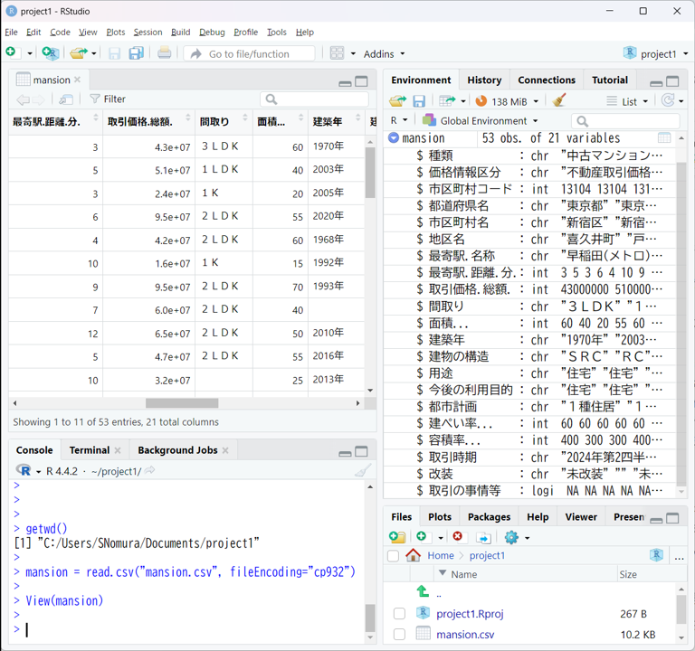
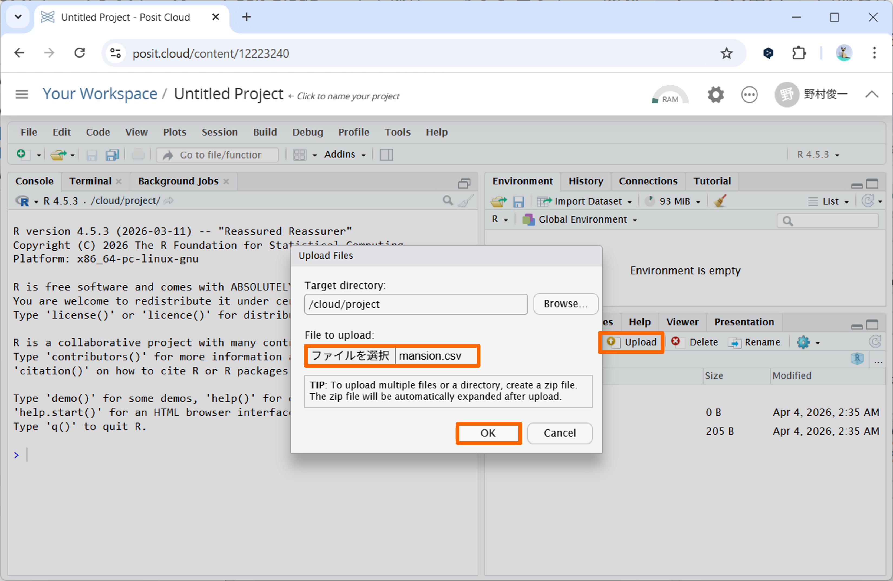
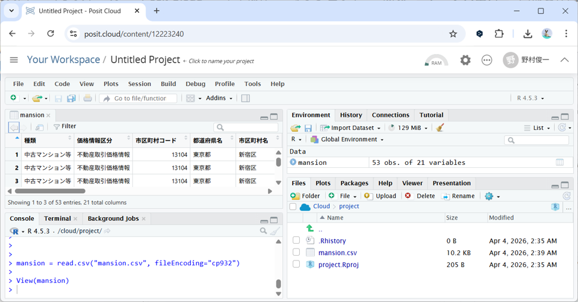
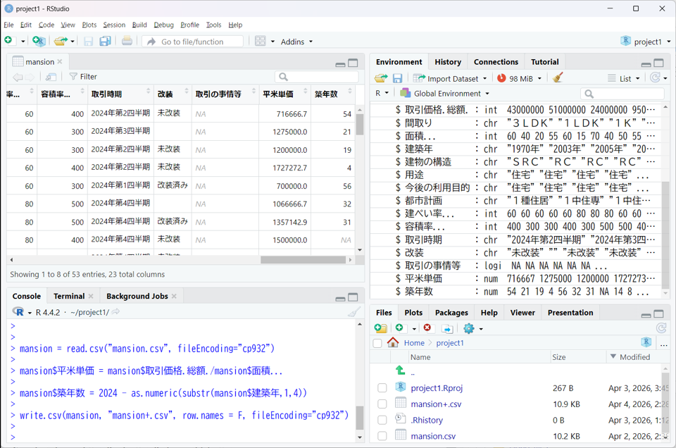
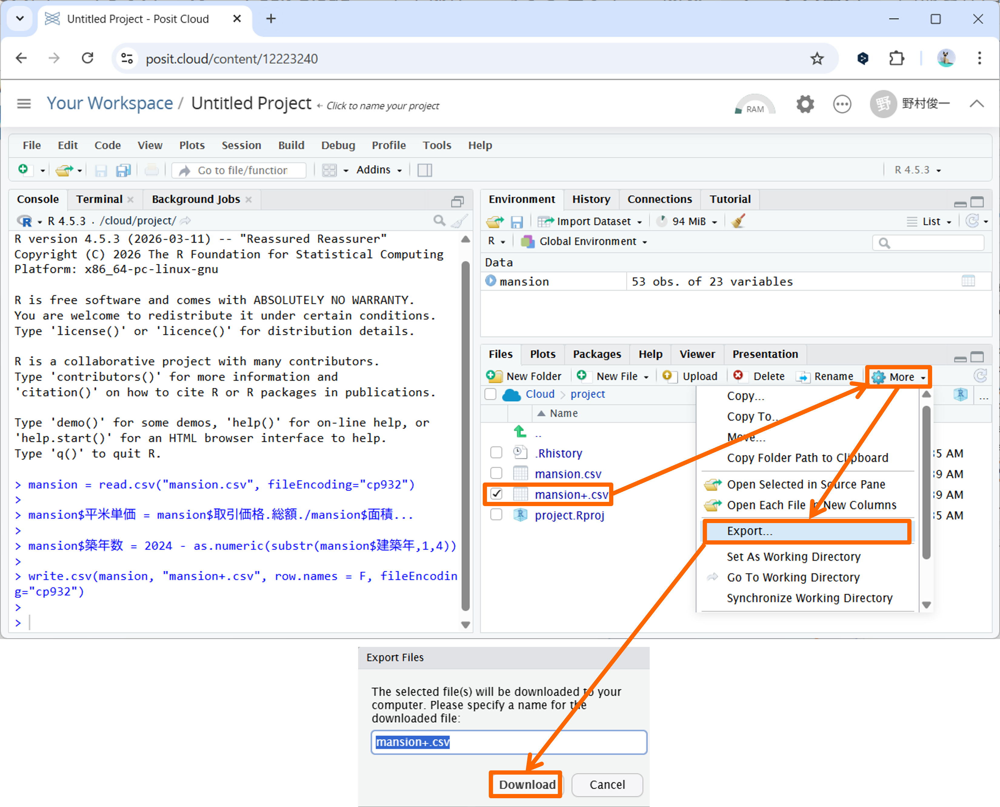

```{r setup, include=FALSE}
knitr::opts_chunk$set(message=FALSE,warning=FALSE, cache=TRUE)
```

実際のデータ分析では、外部のデータファイルを読み込んだり、分析結果をまとめた表をファイルに出力することも必要になります。ここではExcelで扱えるcsv形式（カンマ区切り）のファイルの入出力方法を解説します。

## csvファイルの読み込み

まず、csvファイルをRStudioに読み込む方法から解説します。csvファイルは、あらかじめワーキングディレクトリ（プロジェクトのフォルダ、詳しくは後述）に移してから、次のようにread.csv関数を用いて読み込んでオブジェクトに代入します。

代入するオブジェクト名 = read.csv(\"ファイル名\", fileEncoding=\"cp932\")

上の fileEncoding=\"cp932\" はWindows用の日本語エンコード(Shift-JIS)で書かれた日本語文字を読み込むための引数で、csvファイルに日本語文字が混じっている場合に大抵必要となりますが、csvファイルが英数字のみからなる場合は不要です。

代入されたオブジェクトは、csvファイルの1行目を列名（変数名）、2行目以降をデータ（変数の内容）とするデータフレームなります。もし1行目が列名でなく1行目からデータとして読み込みたい場合には、引数に header = F or FALSEを追加して read.csv(\"ファイル名\", header = F, fileEncoding=\"cp932\") で読み込んでください。なお、任意のフォルダにあるcsvファイルも、read.csv関数内のファイル名をファイルの絶対パス(スラッシュ"/"区切り)に替えることで読み込めますが、詳細は割愛します。

以降では例として、国土交通省のウェブサイトから取得した2024年の中古マンション取引価格情報データ（mansion.csv[ダウンロード](https://drive.google.com/file/d/1EK4IXbaZHOEo7zyPGzyKwWV83Y-ioYZQ/view?usp=sharing)）を読み込みます。

### PC(Windows/Mac)の場合

まずはRStudioのConsoleタブで getwd() と入力して実行してください。すると、下図のように現在起動しているプロジェクトのフォルダ（**ワーキングディレクトリ**と言います）のファイルパスが表示されますので、そのフォルダに上で得た mansion.csv というcsvファイルを移してください。無事に移せたら、下図のように右下のFilesタブに mansion.csv が追加されているのを確認し、Consoleタブに次の命令文を入力して実行してください。

mansion = read.csv(\"mansion.csv\", fileEncoding=\"cp932\")

これにより、mansion.csv がデータフレームとして読み込まれてmansionというオブジェクトに代入されます。Environmentタブにmansionが追加されたことを確認した上で、データビューをConsoleタブでView(mansion)と入力して実行するか、Environmentタブ右端の表アイコンをクリックすることで開き、データの内容を確認しましょう。

{width=60%}

read.csv関数でcsvファイルを読み込む際、csvファイルの1行目にある列名（変数名）は一部記号が"."に置き換わって変化している点に注意してください。たとえば元ファイルでは「最寄駅：距離（分）」だったものが、読み込み後は上図のように「最寄駅.距離.分.」へと変化します。変化後の列名でも差し支えないので本サイトではこのまま進めますが、どうしても元ファイルの列名を使いたい方は前述のcolnames関数を使って元ファイルの列名に置き換えてください。

一方、2行目以降のデータには基本的に変化はないのですが、元ファイルで空欄になっているセルの変化に注意してください。たとえば上図の右上Environmentタブを見ますと、文字列型(chr)である「改装」では元が空欄だったデータは\"\"となっています。しかし、整数型(int)や数値型(num)や論理値型(logi)の変数（「取引の事情等」など）では空欄だったデータはNA(Not available)すなわち欠損値へと置き換わっています。欠損値NAを含むデータは、そのまま合計(sum)や平均(mean)を取っても欠損値NAとなり値が求まらず、関数内に追加の引数na.rm = Tを加えることで欠損値を除いた合計や平均を求めることができます。

### Posit Cloudの場合

Posit Cloudで外部ファイルを読み込むには、外部ファイルをアップロードする必要があります。外部ファイルのアップロードは次の3ステップで行うことができます。

Step.1： 右下のFilesタブの上の方にあるUploadをクリックしてください。

Step.2： 下図のようなウィンドウが現れますので、中段の「ファイルを選択」ボタンをクリックし、アップロードするファイル（mansion.csv）を選択して「開く」ボタンをクリックしてください。

Step.3： 下図のように「ファイルを選択」ボタンの右に選択したファイル名が現れたことを確認し、ウィンドウ右下の"OK"ボタンをクリックしてください。

{width=100%}

無事にアップロードできたら、下図のように右下のFilesタブに mansion.csv が追加されているのを確認し、あとはWindows/Macの場合と同様にファイルを読み込んでください（ワーキングディレクトリの確認は不要です）。

{width=100%}


## csvファイルの書き出し

csvファイルをデータフレームとして読み込むことができるのと同様に、データフレームはcsvファイルへと書き出すことができます。次のようにwrite.csv関数を使用することで、ワーキングディレクトリに入力したファイル名のcsvファイル（カンマ区切り）が保存されます。

write.csv(データフレーム名, \"ファイル名\", row.names = F, fileEncoding=\"cp932\")

上の row.names = F (FALSE)は、行名（行番号）をcsvファイルに書き出さないように敢えて入れており、これを省略すると行名（行番号）がcsvファイルの1列目に書き出されます。また、最後の fileEncoding=\"cp932\" は読み込んだcsvファイルと同じ日本語エンコードで書き出すために加えていますが、書き出すデータフレームが日本語文字を含まない場合やMac版のExcelで参照する場合などは不要です。なお、ファイル名をファイルの絶対パス(スラッシュ“/”区切り)に替えれば任意のフォルダに保存することもできますが、詳細は割愛します。

ここでは例として、上で読み込んだmansionに「平米単価」「築年数」という列を追加したあと、mansion+.csv というファイルで書き出したいと思います。

下図はそれを実際に実行したものです。まず mansion\$平米単価 = mansion\$取引価格.総額./mansion$面積... により単位面積(㎡)あたりの取引価格を求め、「平米単価」という新たな列として定義します。

次に mansion\$築年数 = 2024 - as.numeric(substr(mansion\$建築年,1,4)) により建築年から取引年（2024年）までの経過年数を求め、「築年数」という新たな列として定義します。ここで、建築年は「1970年」のように文字列データとなっているため、文字列を切り取る関数substr(文字列データ,開始位置,終了位置) を用いて1～4文字目の数字のみ切り出し、as.numeric関数で数値に変換しています。

左上のデータビューでmansionの最右列に「平米単価」「築年数」という列が追加されたことが分かります。最後に、上のwrite.csv関数を使ってデータフレームmansionを mansion+.csv というcsvファイルに書き出しており、書き出されたファイルが右下のFilesタブに追加されたことが分かります。

{width=100%}

なお、Posit Cloudの場合、csvファイルを書き出した後に自身のPCへとダウンロードする必要があります。ダウンロード手順は下図のように、Filesタブのダウンロードしたいファイルの左隣をクリックしてチェックを入れ、Filesタブ右上の歯車Moreをクリック、Exportをクリックして、現れたウィンドウでファイル名を確認しダウンロードボタンをクリックしてください。

{width=100%}

