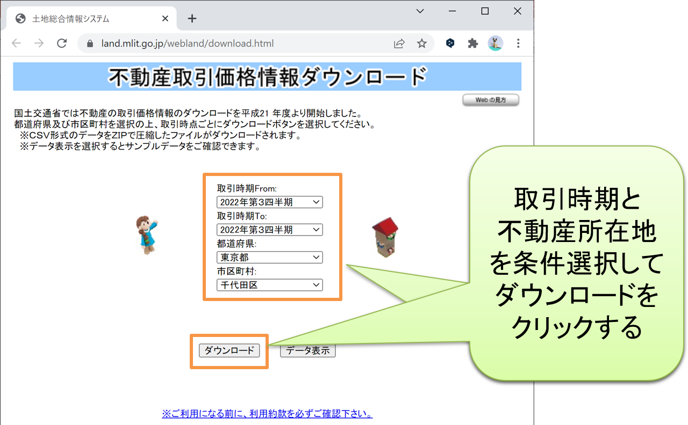
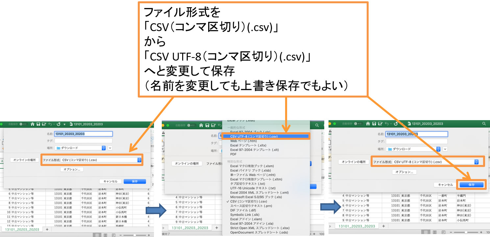

```{r setup, include=FALSE}
knitr::opts_chunk$set(message=FALSE,warning=FALSE, cache=TRUE)
```

実際のデータ分析では、外部のデータファイルを読み込んだり、分析結果をまとめた表をファイルに出力することも必要になります。ここではExcelで扱えるcsv形式（カンマ区切り）のファイルの入出力方法を、Windows, Mac, RStudio Cloudに分けて解説します。

## csvファイルの読み込み

まず、csvファイルをRStudioに読み込む方法から解説します。csvファイルは、あらかじめワーキングディレクトリ（プロジェクトのフォルダ、詳しくは後述）に移してから、次のようにread.csv関数を用いて読み込んでオブジェクトに代入します。

代入するオブジェクト名 = read.csv("ファイル名")

代入されたオブジェクトは、csvファイルの1行目を列名（変数名）、2行目以降をデータ（変数の内容）とするデータフレームなります。もし1行目が列名でなく1行目からデータとして読み込みたい場合には、第2引数にF or FALSEを追加して read.csv("ファイル名", F) で読み込んでください。なお、任意のフォルダにあるcsvファイルも、read.csv関数内のファイル名をファイルの絶対パス(スラッシュ"/"区切り)に替えることで読み込めますが、詳細は割愛します。

以降では例として、国土交通省が公開している不動産取引価格情報のデータ（csvファイル）を読み込みます。[こちらのダウンロードサイト](https://www.land.mlit.go.jp/webland/download.html)から、取引時期と都道府県、市区町村を下図のように選んでダウンロードボタンを押すと、当該期間・地域の取引情報が"13101_20213_20213.zip"というzip圧縮ファイルでダウンロードされます。ダウンロードされたzip圧縮ファイルを解凍（展開）すると"13101_20213_20213.csv"というcsvファイルが得られます。

{width=60%}

### Windowsの場合

まずはRStudioのConsoleタブで getwd() と入力して実行してください。すると、下図のように現在起動しているプロジェクトのフォルダ（**ワーキングディレクトリ**と言います）のファイルパスが表示されますので、そのフォルダに上で得た"13101_20213_20213.csv"というcsvファイルを移してください。無事に移せたら、下図のように右下のFilesタブに"13101_20213_20213.csv"が追加されているのを確認し、Consoleタブに次の命令文を入力して実行してください。

torihiki = read.csv("13101_20213_20213.csv")

これにより、"13101_20213_20213.csv"がデータフレームとして読み込まれてtorihikiというオブジェクトに代入されます。Environmentタブにtorihikiが追加されたことを確認した上で、データビューをConsoleタブでView(torihiki)と入力して実行するか、Environmentタブ右端の表アイコンをクリックすることで開き、データの内容を確認しましょう。

{width=100%}

read.csv関数でcsvファイルを読み込む際、csvファイルの1行目にある列名（変数名）は一部記号が"."に置き換わって変化している点に注意してください。たとえば元ファイルでは「最寄駅：駅名」だったものが、読み込み後は上図のように「最寄駅.駅名」へと変化します。変化後の列名でも差し支えないので本サイトではこのまま進めますが、どうしても元ファイルの列名を使いたい方は前述のcolnames関数を使って元ファイルの列名に置き換えてください。

一方、2行目以降のデータには基本的に変化はないのですが、元ファイルで空欄になっているセルの変化に注意してください。たとえば上図の右上Environmentタブを見ますと、文字列型(chr)である地域では元が空欄だったデータは""となります。しかし、数値型(num)や論理値型(logi)の変数（坪単価など）では空欄だったデータはNA(Not available)すなわち欠損値へと置き換わります。欠損値NAを含むデータは、そのまま合計(sum)や平均(mean)を取っても欠損値NAとなり値が求まらず、関数内に追加の引数na.rm = Tを加えることで欠損値を除いた合計や平均を求めることができます。

### Macの場合

上の不動産取引価格情報のデータをMacのRStudioで読み込むには、あらかじめcsvファイルのエンコードを、Windows用の日本語エンコード(Shift-JIS)から汎用のエンコード(UTF-8)へと変換する工程が必要となります。エンコード変換は、英数字のみからなるデータには必要ありませんが、日本語が混じったデータでは大抵の場合に必要となります。

エンコード変換は、Excelを使えば簡単にできます。まず"13101_20213_20213.csv"をExcelで開き、上端のメニューバーから「ファイル」をクリックし、「名前を付けて保存」をクリックすると、下図のようなウィンドウが現れます。そうしたら下図のように、ファイル形式を「CSV（コンマ区切り）(.csv)」から「CSV UTF-8（コンマ区切り）(.csv)」に変更してから、ファイルの名前は変えずに上書き保存してください（上書きしたくない場合は、保存場所を変えて保存してください）。

{width=100%}

こうして保存されたcsvファイルは、エンコードがMacで扱えるUTF-8となっていますので、あとはWindowsの場合と同様にこのファイルをワーキングディレクトリに移して読み込んでください。

### RStudio Cloudの場合

RStudio Cloudで上の不動産取引価格情報のデータを読み込む際にも、Macと同じくあらかじめcsvファイルのエンコードを汎用のエンコード(UTF-8)へと変換する必要がありますので、まずは上のMacの場合と同様にしてエンコードをUTF-8としたcsvファイルを作成してください（OSがWindowsであっても必要です）。

次に、RStudio Cloudで外部ファイルを読み込むには、外部ファイルをアップロードする必要があります。外部ファイルのアップロードは次の3ステップで行うことができます。

Step.1： 右下のFilesタブの上の方にあるUploadをクリックしてください。

Step.2： 下図のようなウィンドウが現れますので、中段の「ファイルを選択」ボタンをクリックし、アップロードするファイル（UTF-8にエンコード変換した"13101_20213_20213.csv"）を選択して「開く」ボタンをクリックしてください。

Step.3： 下図のように「ファイルを選択」ボタンの右に選択したファイル名が現れたことを確認し、ウィンドウ右下の"OK"ボタンをクリックしてください。

{width=100%}

無事にアップロードできたら、下図のように右下のFilesタブに"13101_20213_20213.csv"が追加されているのを確認し、あとはWindowsの場合と同様にファイルを読み込んでください（ワーキングディレクトリの確認は不要です）。

{width=100%}


## csvファイルの書き出し

csvファイルをデータフレームとして読み込むことができるのと同様に、データフレームはcsvファイルへと書き出すことができます。次のようにwrite.csv関数を使用することで、ワーキングディレクトリに入力したファイル名のcsvファイル（カンマ区切り）が保存されます。

write.csv(データフレーム名, "ファイル名", row.names = F)

ここで、最後のrow.names = F (FALSE)は、行名（行番号）をcsvファイルに書き出さないように敢えて入れており、これを省略すると行名（行番号）がcsvファイルの1列目に書き出されます。なお、ファイル名をファイルの絶対パス(スラッシュ"/"区切り)に替えれば任意のフォルダに保存することもできますが、詳細は割愛します。なお、書き出されるcsvファイルのエンコードはWindowsではShift-JIS、MACとRStudio CloudではUTF-8となります。

ここでは例として、上で読み込んだtorihikiから中古マンション等の取引を抽出して築年数の列を追加した新たなデータフレームmansionを作成し、"mansion.csv"というファイルで書き出したいと思います。

下図はそれを実際に実行したものです。まず torihiki[torihiki\$種類 == "中古マンション等",] により種類が「中古マンション等」の行のみを抽出して新たなオブジェクトmansionに代入しています。続いて、前述したパッケージzipanguを読み込んで 2021 - convert_jyear(mansion\$建築年) を mansion\$築年数 に代入して「築年数」という新たな列を追加します。左上のデータビューでmansionの最右列に築年数という列が追加されたことが分かります。最後に、上のwrite.csv関数を使ってデータフレームmansionを"mansion.csv"というcsvファイルに書き出しており、書き出されたファイルが右下のFilesタブに追加されたことが分かります。

{width=100%}

ここで、もし何らかの原因でzipanguパッケージがインストールできずconvert_jyear関数が使えない場合には、応急処置として以下の命令文（自作のconvert_jyear関数定義）をConsoleタブで実行してから上図のlibrary(zipangu)以外の命令文を順に実行してください。

```{r}
convert_jyear = function(y) ifelse(substr(y,1,2)=="昭和",
  1925+as.numeric(ifelse(substr(y,4,4)=="年",substr(y,3,3),substr(y,3,4))),
  ifelse(substr(y,1,2)=="平成",
  1988+as.numeric(ifelse(substr(y,4,4)=="年",substr(y,3,3),substr(y,3,4))),
  ifelse(substr(y,1,2)=="令和",2018+as.numeric(substr(y,3,3)), NA)))
```

なお、RStudio Cloudの場合、csvファイルを書き出した後に自身のPCへとダウンロードする必要があります。ダウンロード手順は下図のように、Filesタブのダウンロードしたいファイルの左隣をクリックしてチェックを入れ、Filesタブ右上の歯車Moreをクリック、Exportをクリックして、現れたウィンドウでファイル名を確認しダウンロードボタンをクリックしてください。

{width=100%}

