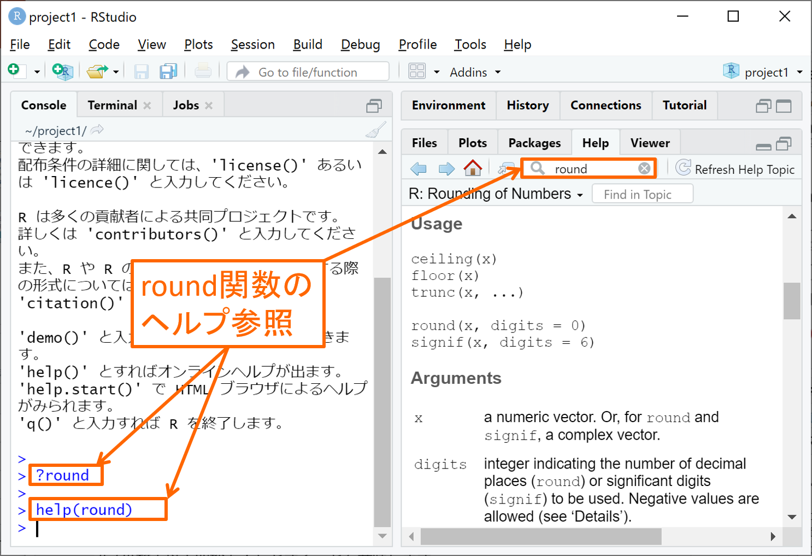
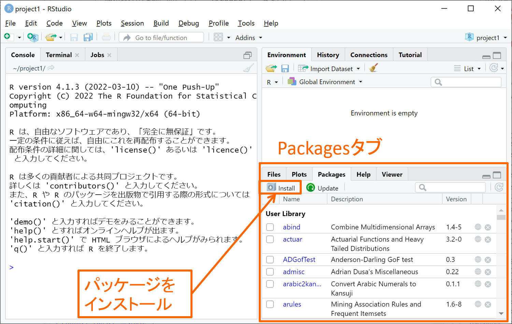
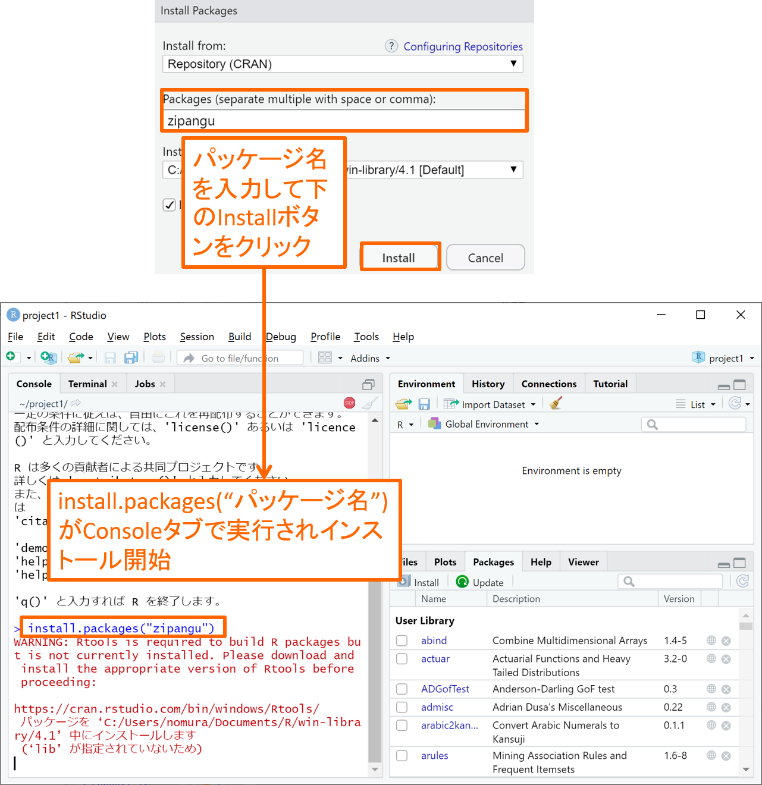
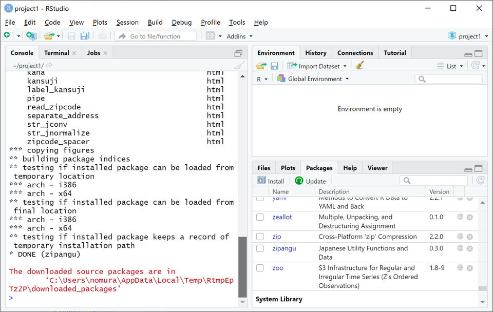
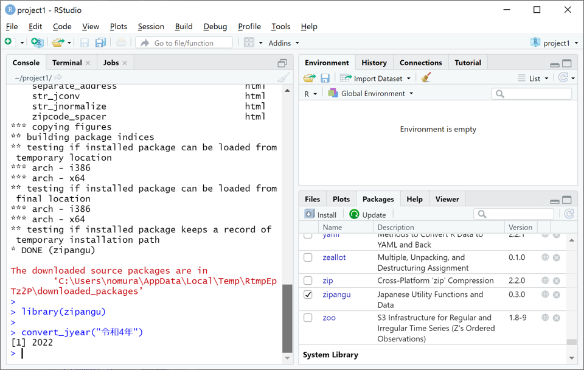

```{r setup, include=FALSE}
knitr::opts_chunk$set(message=FALSE,warning=FALSE, cache=TRUE)
```

## 関数の使い方とヘルプ

Rにおけるデータ分析は、ほとんどが関数（および演算子）を使って進められます。
関数には、関数電卓にあるような対数関数logなどの数学関数だけでなく、回帰分析などのデータ分析を行う関数、作図する関数、外部ファイルの入出力を行う関数など様々なものがあります。既に解説したベクトル、データフレームの作成に用いる c, data.frame も関数です。
さらに、拡張パッケージを導入することにより、世界中で開発された万を超える数の関数が利用可能です。
このページでは、ベクトルやデータフレームに適用できる基本的な関数とパッケージの導入について解説します。

全ての関数は共通して、次のような形で使用します。

関数名(第1引数, 第2引数,..., 引数名a = 引数a, 引数名b = 引数b,...)

上の書き方だけでは分かりませんので、数値を四捨五入する関数roundを例に説明いたします。使い方の分からない関数は、右下のHelpタブで虫メガネの右欄に関数名を入力してEnter(Return)を押すか、Consoleタブで ?関数名 または help(関数名) と入力してEnter(Return)を押すことで、下図のようにHelpタブ上で英語のヘルプを参照することができます。（あるいは、多くの関数はGoogleなどで「r 関数名」などと検索すれば日本語の解説記事も見つかります。）

{width=80%}

上記のround関数のヘルプでは、round以外の関数もいくつか一緒に解説されていますが、上端から少し下にスクロールしますと下図のUsage節にroundの使い方が次のように書いてあります。

round(x, digits = 0)

この関数の中にある文字が「引数名」です。i番目の引数を第i引数と呼ぶことにしますと、xが第1引数、digitsが第2引数の名前となります。引数の意味はUsage節の下のArguments節に書かれており、xはnumeric vectorすなわち数値ベクトル、digitsは小数点以下何桁より下を四捨五入するか指定する整数となります。上では"digits = 0"と書かれていますが、この"="より右の値"0"はデフォルト値（省略時規定値）と呼ばれ、round関数の使用時に引数digitsの値をに指定しなかった場合は自動的にdigits = 0（小数点以下四捨五入）とすることを意味します。

それではround関数を実際に使ってみます。以下に示す４つの命令文は全て1.2の小数点以下を四捨五入しています。

```{r}
round(1.2) # 第1引数 x のみに値を入れる（第2引数 digits はデフォルト値 0 となる）
round(1.2, 0) # 第1引数 x と第2引数 digits に順に値を入れる
round(x = 1.2, digits = 0) # 第1引数 x と第2引数 digits に引数名を指定して値を入れる
round(digits = 0, x = 1.2) # 第2引数 digits と第1引数 x に引数名を指定して値を入れる
```

上の例のように、関数の使い方にはいくつかバリエーションがあることを覚えておいてください。引数の入れ方の注意点をまとめると以下の通りです。

- Usageにある順番通りに引数の値を入れる場合には、関数内に引数の値だけ入力すればよい。

- Usageにある順番を無視して引数の値を入れる場合には、「引数名 = 引数の値」と引数名を指定する必要がある。

- デフォルト値をもつ引数には、値を入れなければ自動的にデフォルト値が入る。

## ベクトルに使う関数

ここでは、ベクトル（単一の値の場合も含む）に対して良く使われる関数をごく簡単に紹介します。

まず以下に示すのは、ベクトルの要素ごとに単純な数値演算を行う数学関数です。計算不能な負の値の平方根や対数はNaN(非数値)という結果（以降、**戻り値**と呼びます）になります。

```{r}
v = c(-1.24, 0, 4, 0.5) # 数値ベクトルを作成
abs(v) # 絶対値
floor(v) # 小数点未満切り捨て
round(v, 1) # 小数第１位未満を四捨五入
sqrt(v) # 平方根
log(v, 10) # 対数関数（第2引数は対数の底）
```

次に以下に示すのは、ベクトルを集計・操作する関数です。それぞれベクトルの集計値あるいは操作されたベクトルを戻り値として返します。

```{r}
length(v) # ベクトルの要素数
sum(v) # 数値ベクトルの総和（全ての要素の和）
prod(v) # 数値ベクトルの総乗（全ての要素の積）
mean(v) # 数値ベクトルの平均（＝総和/要素数 sum(v)/length(v)）
sort(v) # ベクトルの要素の並べ替え（デフォルトは昇順）
sort(v, T) # ベクトルの要素の並べ替え（第2引数にTまたはTRUEを入れると降順になる）
```

上の例で、sort関数の使い方(Usage)は次の通りです。ちなみに、文字列ベクトルもsort関数で並べ替えが可能です。

sort(x, decreasing = FALSE) （第2引数 decreasing がTRUEなら降順、FALSE（デフォルト）なら昇順）

最後に以下に示すのは、ベクトルを値の種類ごとにグルーピングして集計する関数tableとtapplyです。

```{r}
w = c("A","B","A","C") # 文字列ベクトルを作成
table(w) # ベクトルの値の種類ごとの出現回数を集計
tapply(v, w, sum) # w の値の種類ごとの v の値の総和(sum)を集計
tapply(v, w, mean) # w の値の種類ごとの v の値の平均(mean)を集計
tapply(v, w, sum)/table(w) # w の値の種類ごとの v の値の総和/出現回数＝平均 を算出
```

ベクトルの値の種類ごとの出現回数を集計するtable関数は、１行目：集計したベクトル名、２行目：値の種類、３行目：出現回数のように３行にわたって戻り値が表示されます。

tapply関数はやや複雑ですが、第2引数(w)の値の種類ごとの第1引数(v)の値を第3引数の集計関数(sum,meanなど)で集計し、１行目：値の種類、２行目：集計値のように２行にわたって戻り値が表示されます。このように、引数にはベクトルだけでなく関数自体が入ることもあります。

なお、table関数やtapply関数の戻り値は、値の種類を要素名（要素番号の代わり）とした集計値の数値ベクトルとして扱われ、上の最後の例のように数値ベクトルとして四則演算などに用いることができます。

## データフレームに使う関数

データフレームはベクトルを列結合したものであるため、以下のように列ごとにベクトルに対する関数が適用できます。

```{r}
vw = data.frame(v = v, w = w) # ベクトル v と w を列結合したデータフレームを作成
sum(vw$v) # vw$v の総和
tapply(vw$v, vw$w, mean) # vw$w の値の種類ごとの vw$v の値の平均(mean)を集計
```

ここではさらに、データフレームに対して良く使われる簡単な関数をいくつか紹介しておきます。

- nrowとncolは、データフレームの行数と列数を取得する関数。

- headとtailは、第1引数のデータフレームの先頭と末尾を第2引数の行数だけ取得する関数。

- rownamesとcolnamesは、データフレームの行名（行番号）と列名（変数名）を参照する関数。参照するだけでなく、全部または一部に別の文字列を代入して置き換えることもできます。

以下にその例を示します。

```{r}
nrow(vw) # データフレームの行数
ncol(vw) # データフレームの列数
head(vw,2) # データフレームの先頭2行を表示
tail(vw,3) # データフレームの末尾3行を表示
rownames(vw) # データフレームの行名
colnames(vw)[2] = "ABC" # データフレームの列名（変数名）を一部置き換え
colnames(vw) # データフレームの列名（変数名）
```

## パッケージ

最後に、パッケージをインストールして、パッケージ内の関数を利用する方法を解説します。
ここでは、日本人に便利な関数をまとめた[zipanguパッケージ](https://uribo.hatenablog.com/entry/2019/12/02/163114)をインストールして、パッケージ内にある和暦を西暦に変換する関数convert_jyearを使ってみたいと思います。

パッケージには初めからインストール済であるものもあります。下図の右下にあるPackagesタブで、インストール済のパッケージの一覧を見ることができます。一覧の中に目的のパッケージが無かったり、以前に目的のパッケージを使ってから長い年月が経っている（パッケージのバージョンが古い）場合には、次に解説する方法で目的のパッケージをインストールしましょう。

{width=70%}

パッケージのインストールは、Consoleタブにinstall.packages("パッケージ名")と入力して実行すれば、あとは下図のように自動でインストールが進みます。あるいは、Packagesタブの左上にあるInstallボタンをクリックして出てくる下図のウィンドウの中段にパッケージ名を入力し下のInstallボタンをクリックすると、Consoleタブにinstall.packages("パッケージ名")が自動入力されて同じようにインストールが始まります。

{width=70%}

インストールが完了すると、下図のようにPackagesタブの一覧にインストールしたパッケージ（zipangu）が追加されていることが確認できます。ただし、インストールが完了しただけではまだパッケージの関数を使うことはできません。パッケージを利用するには、Consoleタブにlibrary(パッケージ名)と入力して実行するか、Packagesタブの青字のパッケージ名の左にある四角をクリックしてチェックすることで、パッケージを読み込む必要があります。

{width=70%}

下図のようにzipanguパッケージが読み込まれたら、zipanguパッケージ内のconvert_jyear関数を使ってみましょう。convert_jyear関数は様々な形式の和暦を西暦へと変換する関数です。詳細はHelpタブを見るよりも[開発者による解説](https://uribo.hatenablog.com/entry/2019/12/02/163114)を参照した方が分かりやすいです。下図では和暦"令和4年"をconvert_jyear関数に入れると西暦2022が返ってくる例を示しています。

{width=70%}

