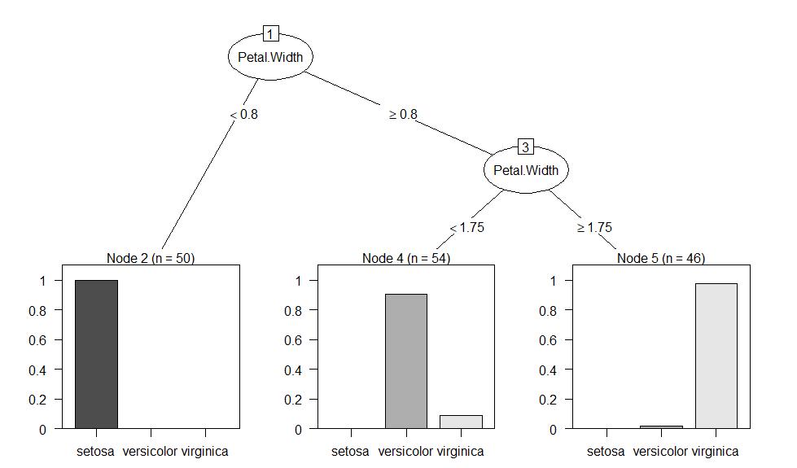
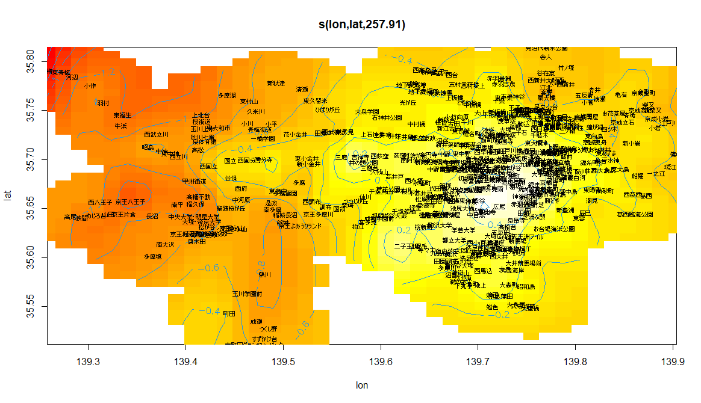
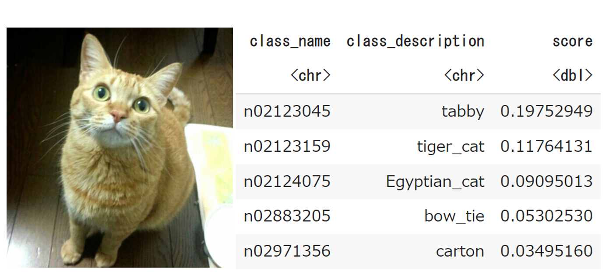

```{r setup, include=FALSE}
knitr::opts_chunk$set(message=FALSE,warning=FALSE, cache=TRUE)
```

## 本サイトの目的

本サイトでは、データサイエンス学習のためにRおよびRStudioをこれから使い始める方向けにR・RStudioの入門的解説を行います。

## データサイエンスの重要性

インターネットなどに溢れかえる玉石混交の情報を適切に読み解くリテラシーは、現在の情報化社会で活躍するための必須スキルです。その中でも、集約された情報であるデータを定量的に分析して有益な知見を得るためのデータ分析スキルは、一定以上の数理能力・プログラミング能力などの専門性を要する高度なスキルとなります。データサイエンスとはデータを定量的に分析する方法論を扱う学問であり、それを駆使する人材をデータサイエンティストと言います。データサイエンスはたとえば以下のように現代社会の至るところで重要な役割を果たしており、データサイエンティストはその高度な専門性と有益性から社会で重宝されています。

- <u>将来予測</u>：企業の業績予想やウイルス感染の拡大予測など、あらゆるデータの将来予測にはデータサイエンスに基づく定量的分析が利用できます。

- <u>異常検知</u>：データ全体の傾向と比べて特異なデータを抽出してその原因を調査することにより、原因に潜むエラーや不正を検出します。

- <u>経営管理</u>：工場の生産管理、製品の品質管理や在庫管理、営業の業績管理など、経営管理の過程で得られるデータを分析して経営効率の改善策を検討します。

- <u>リスク評価</u>：保険契約の事故リスク（交通事故・火災などによる保険金支払い）を分析して適切な保険料を定めたり、災害リスク（台風・地震などによる損害）を分析して事業継続への影響やリスク軽減策を検討します。

- <u>マーケティング</u>：顧客の属性（年齢、地域など）による購買傾向の違いを分析して商品の販売戦略を検討したり、顧客アンケートの集計結果や自由記述を分析して満足度向上に有効な施策を検討します。

- <u>実証研究</u>：実験・調査によるデータから仮説を実証するあらゆる分野の研究において、正しい理解に基づく統計分析が必要とされます。

- <u>人工知能</u>：顔認証、音声認識、自動翻訳などの現代社会の至るところに組み込まれている人工知能も、ディープラーニングなどのデータサイエンスが基盤となっています。

## Rとは

Rとは、主にデータ分析に利用される完全無償のプログラミング・ソフトウェアです。Python, Java, Cなどの汎用的なプログラム言語と比べると、Rはデータ分析に特化したプログラム言語となっており、以下に挙げる3つの強みを持っています。プログラミング経験者にはPythonもお薦めできますが、全くのプログラミング未経験者にはやや敷居が高く、1行からのごく短いプログラムでデータ分析が可能で未経験者に易しいRの習得をまずお薦めしています。

#### <u>強み１．1行からのごく短いコードでデータ分析が可能</u>

汎用的なプログラム言語では、その汎用性がゆえに最初に基本関数のライブラリを読み込んだり変数の型を定義するためソースコードが必然的に長くなり、コードを書く側にも読む側にも負担を与えます。

Rでは基本関数の読み込みや変数の型定義が不要であり、さらに、データ分析手法ごとに用意された関数を使えばたった1行の命令文でデータへ分析手法を適用できます。

たとえば、RStudioを起動できましたらConsoleタブ（後述）に次の1行の命令文を入力（命令文と貼り付け）し実行してみてください。下図のように年齢構成と可処分所得に基づく50か国のクラスタリング（データの近しい国から順に線で繋げていくグルーピング）が図示されるはずです。

```{r}
plot(hclust(dist(LifeCycleSavings)),cex=0.7)
```


#### <u>強み２．プログラムを書いたそばから1行ずつ実行可能</u>

一般にプログラミングというと、あらかじめ長いソースコードを書き上げてからパソコンでコンパイルしてエラーを全部解消しないと実行できないものが多く、その作業過程に慣れないととても煩雑に感じられてしまいます。しかしRでは、画面上で1行命令文を書いて改行すれば、その命令文が即座に実行されその場で実行結果を確認することができます（これをインタープリタ型言語と言います）。また、前に実行した命令文は打ち込み直さなくても↑（上矢印）キーですぐに呼び出すことができます。

1行ずつ命令文を打ち込んでその実行結果を確認できるので、エラーを出しがちな初心者でも1行ずつトライ＆エラーで着実にデータ分析を進めることができます。もちろん、後述するスクリプトファイルにソースコードを書き溜めてまとめて実行することもできます。

#### <u>強み３．高度で専門的なものまで様々な分析手法が簡単に利用可能</u>

Rの一番の売りは、扱える分析手法の豊富さにあると考えています。
Rはオープンソースのプログラム言語であり、誰でも新たな分析手法を実装したパッケージを作って公開することができます。そのため、世界中で開発・公開されているパッケージはなんと1万を超えており、他のプログラム言語に比べて群を抜く数の分析手法を扱うことができます。
データ分析手法は社会科学、生物科学、医学など様々な分野で独自の発展を遂げており、その高度で専門的な分析手法も、実装済のパッケージをインストールすれば関数1つで適用することができます。

データ分析用のソフトウェアには他にもSAS, SPSS, STATAなどがあり、それぞれRに対して優位な点もあります。しかし、これらのソフトウェアはすべて有償であり就職先でも利用できるとは限りませんし、扱える分析手法の豊富さではやはりRが優れています。
また、エクセルでも回帰分析のような最も基本的なデータ分析は可能ですが、Rでは以下に挙げるようなテキストデータ分析やディープラーニングなどの高度な分析を無料で手軽に扱うことができます。

  
{width=60%}

  
{width=60%}

  
{width=90%}

  
{width=70%}

## RStudioとは

RStudioは、Rによるプログラミングを手助けするアプリケーションです。RStudioは一見独立したアプリケーションに見えますが、RStudioから送られる命令文は内部でRを動作させることで実行されています。つまり、RStudioで実行可能なプログラムはほぼRでも実行可能なのですが、RStudioには便利な機能がたくさん備わっているため、以降のページではRStudioの使い方に絞って解説いたします。


