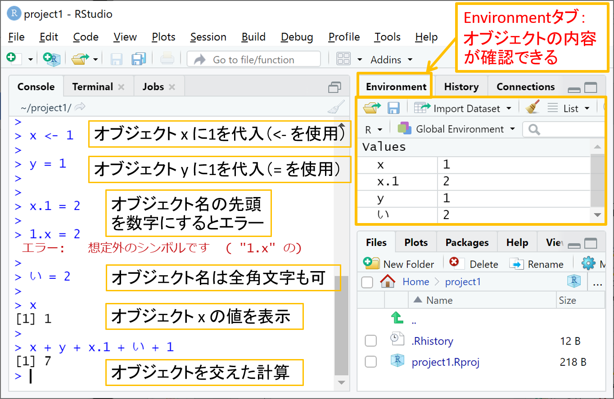
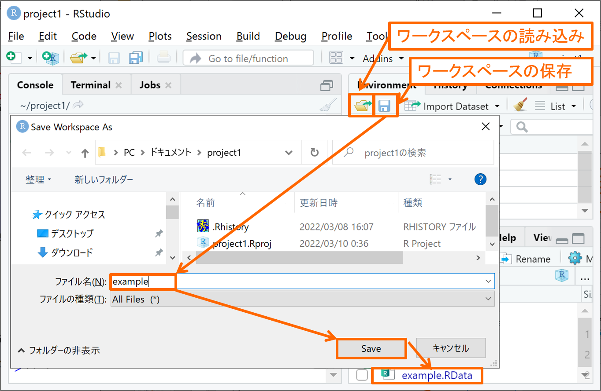
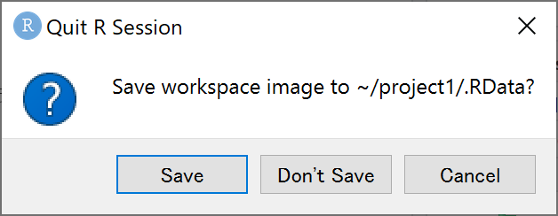
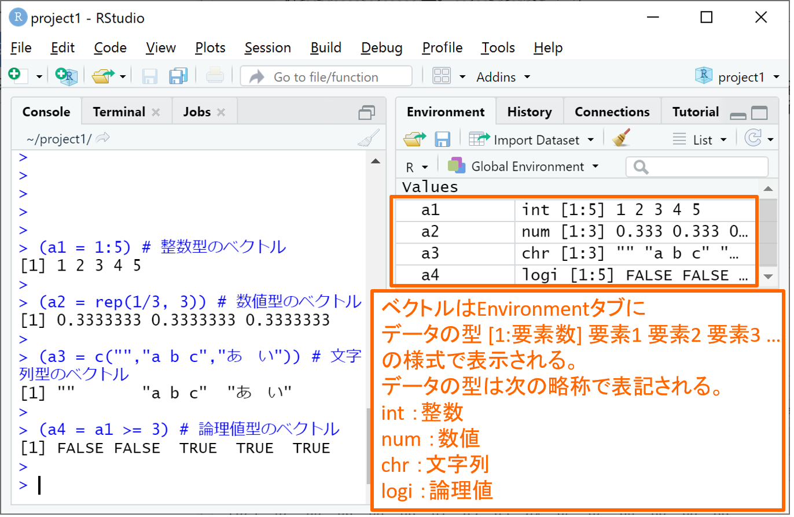
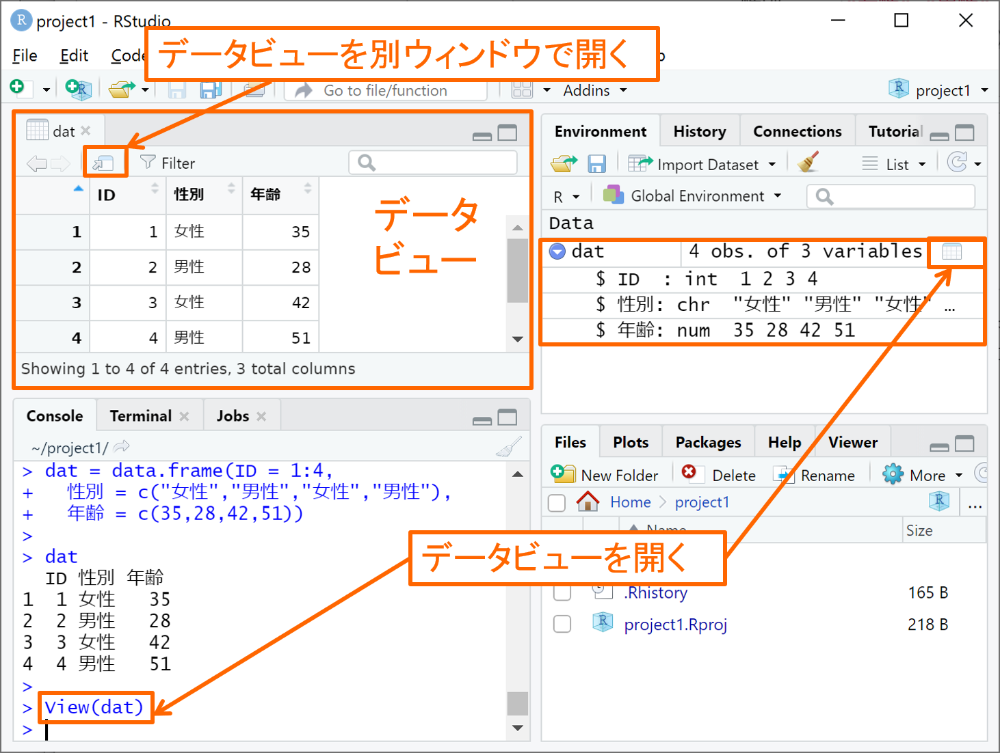
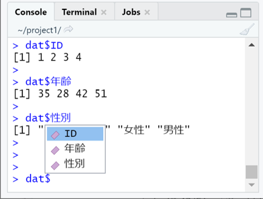

```{r setup, include=FALSE}
knitr::opts_chunk$set(message=FALSE,warning=FALSE, cache=TRUE)
```

## オブジェクトとは

Rでは、殆どのプログラム言語と同様に、xなどの変数に値を代入してその後の命令文に使用することができ、これをオブジェクトと呼びます。オブジェクトの定義（値の代入）は、下図のように命令文「オブジェク名 <- 値」または「オブジェク名 = 値」により行われます。オブジェク名に使用できる文字は、半角英数、ピリオド(.)、アンダーバー(_)と全角文字で、半角英字の大文字と小文字は区別されます。ただし、オブジェクト名の先頭は、半角英字か全角文字でなければなりません。

{width=75%}

定義されたオブジェクトは、Consoleタブにオブジェクト名だけ入力して実行すれば、その値を確認できます。ただし、定義されたオブジェクトは右上のEnvironmentタブに一覧表示されますので、Consoleタブを使わずとも何という名前のオブジェクトに大まかに何が入っているかを確認することができます。

## ワークスペース

Environmentタブに列挙されている全オブジェクトは、まとめて「ワークスペース」と呼ばれる拡張子.RDataのファイル形式で下図のように保存することができます。保存されたワークスペースは、右上のEnvironmentタブ内のフォルダから矢印が出たアイコンをクリックして選択するか、右下のFilesタブ内のワークスペースのファイル(.RDataファイル)をクリックすることで読み込むことができます。

{width=75%}

なお、アプリケーションのRStudioを閉じる際には下図のように現在のワークスペースを保存するかどうか聞かれ、Saveボタンをクリックして場合には".RData"というファイル名でワークスペースが（上書き）保存されます。
一般に、プロジェクトを開いたときにはそのプロジェクトのフォルダにある".RData"のワークスペースが読み込まれた状態でRStudioが起動することになります。したがって、".RData"を異なるファイル名（たとえば"a.RData"）に改名したり削除したりすれば、ワークスペースが読み込まれずオブジェクトの何もない状態でプロジェクトが起動することになります。

{width=30%}

## ベクトル

Rでは、殆どのプログラム言語と同様に、オブジェクトに複数の値を代入することができます。
オブジェクトに複数の値を持たせる形式はいろいろとあり、まず最も代表的なベクトルとその基本的な扱い方を紹介します。

### ベクトルの作成

ベクトルとは、同じ型（後述）の値を持つ要素を１列に並べたものです。上図の１つの値しか持たないオブジェクトも、実は要素数１のベクトルとして扱われます。ベクトルを作成する最も代表的な３つの方法とその例を以下に示します。

- c(要素1, 要素2, 要素3,...) で、要素1, 要素2, 要素3,...のベクトルが作成されます。

- rep(要素, 繰り返し数) で、同じ要素を繰り返し数だけ並べたベクトルが作成されます。

- 最初の整数:最後の整数 で、最初の整数から最後の整数まで1ずつずらした整数列のベクトルが作成されます。

```{r}
c(1,2,3,4) # c(要素1, 要素2, 要素3, 要素4)
rep(1,5) # rep(繰り返す要素, 繰り返し数)
1:100 # 最初の整数:最後の整数
```

上には灰色枠内の命令文をそれぞれ実行した結果が白枠内にRStudioのConsoleタブと同じ形式（各行頭に##が付くことを除く）で表示されています。
ベクトルは上の白枠内のように、左から順に要素が一定間隔で並べられて表示されます。
最後の1:100（1から100までの整数列）の例のように要素数が多いときには、途中で改行されて複数行にわたって表示され、各行の先頭には[行の最初の要素の要素番号]が表示されます。

### ベクトルの代入と参照

上のように作成されたベクトルは、そのままオブジェクトに代入することができます。
ベクトルの代入されたオブジェクト（ベクトル）について以下のように、ベクトル名[参照したい要素番号（整数値 or 整数ベクトル）] のように入力することで、指定した要素番号の要素だけを参照して表示あるいは代入することができます。


```{r}
a = c(10,20,30,40,50) # オブジェクト（ベクトル）a を定義
a # ベクトル a の全要素を表示
a[2] # ベクトル a の2番目の要素を表示
a[5:1] # ベクトル a の5,4,3,2,1番目の要素を順に表示
a[c(1,3)] = a[c(3,1)] # ベクトル a の3,1番目の要素をベクトル a の1,3番目の要素へと代入
a # ベクトル a の1,3番目の要素が入れ替わっていることを確認
a[c(1,3)] = c(10,30) # ベクトル a の1,3番目の要素に10,30を代入
a # ベクトル a が元に戻っていることを確認
```

ベクトルの一部要素を参照するもう一つの重要な方法として条件指定があります。以下に例示する比較演算子を用いて、ベクトル名[条件式（左辺 比較演算子 右辺）] のように入力することで、条件式を満たす要素番号の要素だけを参照することができます（厳密には、後述する論理値のベクトルであれば条件式でなくて構いません）。

- ==：左辺と右辺が等しい

- !=：左辺と右辺が等しくない

- \>=：左辺が右辺以上である

- <=：左辺が右辺以下である

- \>：左辺が右辺を上回る

- <：左辺が右辺を下回る

- %in%：左辺が右辺の要素のいずれかと等しい

```{r}
a[a >= 30] # 3以上である a の要素を参照
b = c(50,40,30,20,10) # オブジェクト（ベクトル）b を定義
a[a == b] # a と b の要素が等しい要素番号(3番目)における a の要素を参照
a[b %in% c(10,30)] # b が 10,30 のいずれかと等しい要素番号(3,5番目)における a の要素を参照
```

### ベクトルの四則演算

ベクトルはそのまま要素ごとの四則演算に用いることができ、複数の数値をまとめて素早く計算できる大きな利点があります。

```{r}
a + b # ベクトル同士の足し算
a * b # ベクトル同士の足し算
a - 10 # ベクトル a の各要素から 10 を引く
a / 10 # ベクトル a の各要素を 10 で割る
```

## データの型

ここまでのオブジェクトは全て数値を扱ってきましたが、数値以外の「型」のデータも扱うことができます。データの型には多種多様なものがありますが、ここでは最も基礎的な以下の４つのみ紹介します。

- 整数(integer)：整数のみからなるベクトルの型。ただし扱い方は次の数値型と全く変わらないので区別する必要はない。

- 数値(numeric)：整数以外も含んだ数値からなるベクトルの型。

- 文字列(character)：文字列なるベクトルの型。ダブルクォーテーション\"\"で囲まれたものが1つの文字列と見なされる（\"\"のみなら空の文字列として扱われる）。

- 論理値(logical)：TRUE(Tと略記可)とFALSE(Fと略記可)のいずれかの値しか取らないベクトルの型。これらはTRUE=T=1, FALSE=F=0の数値としても扱える（文字列としては扱えない）。上の「ベクトルの要素参照」で扱った 条件式（左辺 比較演算子 右辺） はそれ自体が論理値からなるベクトルとして扱われる。

以下に例を挙げます。ここで、オブジェクトにデータを代入する命令文全体を丸括弧()で括ることで、以下のように代入と同時に代入された内容を表示されることができます。

```{r}
(a1 = 1:5) # 整数型のベクトル
(a2 = rep(1/3, 3)) # 数値型のベクトル
(a3 = c("","a b c","あ　い")) # 文字列型のベクトル
(a4 = a1 >= 3) # 論理値型のベクトル
```

複数の要素を持つベクトルはEnvironmentタブのオブジェクト一覧において下図のように

オブジェクト名 | データの型 [1:要素数] 要素1 要素2 要素3 ...

の様式で表示されます。データの型はint:整数、num:数値、chr:文字列、logi:論理値のように略称で表記されます。

{width=75%}

## データフレーム

オブジェクトに複数の値を持たせる形式としてはベクトルの他に「データフレーム」もよく利用されます。データフレームは一言で言うと「同じ要素数のベクトルを列ごとに並べた表形式のデータ」であり、csvファイルなどの表形式のデータを読み込んで扱うのに適した形式となっています。

ここではファイル読み込みを経ずにデータフレームを新規に作成する方法のみ解説し、作成済のデータフレームの扱い方については後の「ファイル入出力」にて解説します。

### データフレームの作成

データフレームは上述の通り「同じ要素数のベクトルを列ごとに並べたもの」として次のように作成します。

data.frame(列名1 = ベクトル1, 列名2 = ベクトル2, 列名3 = ベクトル3,...)

上記の各ベクトルは、要素数さえ同じであれば、データの型がベクトル間で異なっていても構いません。以下に例を示します。

```{r}
dat = data.frame(ID = 1:4,
                 性別 = c("女性","男性","女性","男性"),
                 年齢 = c(35,28,42,51))
dat # 作成したデータフレームを表示
```

上の例では、ID, 性別, 年齢の３つの変数(variables)をもつ４つの観測データ(observation)からなるデータフレーム dat を作成しました。作成したデータフレームを表示すると、定義した順に変数が列に並び、変数名の下に４つの観測データの行が並んでいます。

作成されたデータフレームは下図のようにEnvironmentタブに表示されます。データフレーム名(dat)の右には観測データ(obs.)の数と変数(variables)の数が表示され、さらに右にある表の形をしたアイコンをクリックすると、左上にデータフレームが表形式で表示されます（これをデータビューと言います）。データビューはConsoleタブ上で Vier(データフレーム名) と入力して実行することでも開くことができます。さらに、下図のデータビュー内にある表に矢印が付いたアイコンをクリックすることで、データビューを別ウィンドウで開くこともできます。

また、Environmentタブのデータフレーム名(dat)の左隣にある丸囲み三角をクリックすると、下図のように各変数について 変数名：データ型 要素1,要素2,... の形で内容を見ることができます。もう一度、丸囲み三角をクリックすれば各変数の欄は閉じられます。

{width=75%}

### データフレームの代入と参照

データフレームは、行と列の表形式にデータが並んでいるため、その要素は

データフレーム名[行番号のベクトル, 列番号or列の変数名(\"\"で囲む)のベクトル]

の形で参照して表示あるいは代入することができます。このとき、行あるいは列の指定を省略すると、全ての行あるいは列を参照することになります。

```{r}
dat[1,2] = "男性" # 1行目2列目のデータに"男性"を代入
dat[1,] # 1行目全列のデータを表示
dat[1,2] = "女性" # 1行目2列目のデータに"女性"を代入して戻す
dat[,c("性別","年齢")] # 全行の性別, 年齢のデータを表示
dat[1:2,2:3] # 1,2行目2,3列目のデータを表示
```

もう１つ、データフレームでは データフレーム名\$変数名 により指定した変数名の列だけ参照することができます。RStudioでは「データフレーム名\$」まで入力した時点で下図のように変数名の候補が表示され、参照したい変数名をクリックすることで変数名が自動入力されます。データフレームは各変数のベクトルを列結合して構成されているため、１つの列（変数）を参照したときはベクトルとして参照されます。

{width=40%}

データフレームから参照する行は、行番号でなく条件式（論理値のベクトル）で指定することもでき、以下のように条件式による行の絞り込みのために頻繁に用いられます。

```{r}
female = dat[dat$性別 == "女性", ] # 性別が女性の行だけ抽出して female に代入
female
over30 = dat[dat$年齢 >= 30, ] # 年齢が30歳以上の抽出して over30 に代入
over30
```
### データフレームの列追加

データフレームは一旦定義した後から、次のようにして列（変数）を新たに追加することができます。

データフレーム名\$変数名 = ベクトル

たとえば以下のようにして、女性か否かを論理値(TRUE or FALSE)で表す列が新たに追加されます。

```{r}
dat$女性か否か = dat$性別 == "女性"
dat
```

### データフレームの四則演算

データフレームは前述の通り各列（変数）がベクトルとして扱われるため、個々の列（変数）を参照してベクトルと同様に四則演算に用いることが可能です。

```{r}
dat$年齢 + 10 # 10年後の年齢
```

しかし、行ごとにはたとえデータの型が同じであろうとベクトルとして扱うことができず、個々の行や複数の列を参照して四則演算に用いるとエラーとなりますので注意してください。

